# MediThread System Architecture

> Reverse-engineered from the code in this repository (branch state at commit `0bd42e9`, October 2026).
> Every claim points at a file. Labels used throughout:
>
> - **Implemented**: read in the source code or configuration.
> - **Inferred from implementation**: follows from reading several pieces of code together, not stated anywhere directly.
> - **Documented, not re-measured**: a number taken from the project's own documentation (`README.md`, `CLAUDE.md`, `docs/vault/*.md`). The load and chaos tests need the full Docker stack and a Supabase database, which were not run while writing this document.
> - **Not verified in repository**: no code or config backs the claim.
> - **NOT IMPLEMENTED / Planned / not implemented**: the code does not do this.
>
> Section 28 lists the places where the project's own docs or code comments disagree with the code.

## Contents

1. [Executive Summary](#1-executive-summary)
2. [System Context](#2-system-context)
3. [High-Level Architecture](#3-high-level-architecture)
4. [Component Architecture](#4-component-architecture)
5. [Frontend Architecture](#5-frontend-architecture)
6. [Backend Architecture](#6-backend-architecture)
7. [AI Agent Architecture](#7-ai-agent-architecture)
8. [Tool Execution Architecture](#8-tool-execution-architecture)
9. [Medical Document Pipeline](#9-medical-document-pipeline)
10. [Database Architecture](#10-database-architecture)
11. [Redis Architecture](#11-redis-architecture)
12. [Queue and Worker Architecture](#12-queue-and-worker-architecture)
13. [Authentication and Authorization](#13-authentication-and-authorization)
14. [Security Model](#14-security-model)
15. [AI Safety Model](#15-ai-safety-model)
16. [Token Optimization](#16-token-optimization)
17. [Scalability](#17-scalability)
18. [Reliability](#18-reliability)
19. [Failure Modes](#19-failure-modes)
20. [Load Testing](#20-load-testing)
21. [Chaos Testing](#21-chaos-testing)
22. [Observability](#22-observability)
23. [Deployment Architecture](#23-deployment-architecture)
24. [External Integrations](#24-external-integrations)
25. [Data Flow Diagrams](#25-data-flow-diagrams)
26. [Sequence Diagrams](#26-sequence-diagrams)
27. [Architecture Decisions](#27-architecture-decisions)
28. [Current Limitations](#28-current-limitations)
29. [Bottlenecks](#29-bottlenecks)
30. [Future Scaling Strategy](#30-future-scaling-strategy)

---

## 1. Executive Summary

MediThread is a personal health-record system. A patient account owns one `patients` row. The patient adds data in four ways: photo or PDF uploads (read by Gemini), hospital FHIR R4 bundles, home readings typed into a form, and files given to the AI agent. A doctor sees a patient's record only after the patient gives them a one-time invite code (which creates a `care_links` row) or a share link or QR code (a `share_links` row). Doctors record visits in a voice console. A visit note reaches the patient's record only when the doctor approves it.

The system is one Python codebase (FastAPI, `BackEnd/app` and `BackEnd/ai`) that runs in three process roles, plus a React single-page app (`Frontend/src`):

| Process role | Entry point | What it does |
| --- | --- | --- |
| API | `uvicorn app.main:app` | All HTTP routes. Stateless in queue mode. |
| Upload worker | `python -m app.worker_main` | Takes upload jobs from a Redis list and runs the extraction pipeline. |
| Scheduler | `python -m app.scheduler_main` | Sends Telegram reminders. One leader at a time, chosen through a Redis lease. |

The same code also runs as a single process (API, uploads in a thread, scheduler inside). The Render deploy and local `uvicorn` do this: `SCHEDULER` defaults to on and `QUEUE_MODE` defaults to off.

**The main design rule** (Implemented): language models produce text and proposals. Plain Python makes every decision that changes data or safety state:

- The agent's LLM can only name one of **46 registered tools**. A single executor validates the arguments, checks permissions, asks the human to confirm writes, verifies the result and writes an audit row (`BackEnd/app/agent/executor.py`).
- Danger checks, interaction alerts, trend alerts and reminders are plain Python (`app/risk.py`, `app/trends.py`, `ai/safety.py`, `app/reminder_service.py`).
- Agent-ingested documents keep an extracted value only if it is found in the document's own text, with page, line and quote (`app/agent/extract.py`).

**Measured (Documented, not re-measured)**: an agent question went from about 8,800 to about 2,500 tokens. Going from 1 to 3 API copies took throughput from about 57 to 100 requests/s at 100 concurrent users. Killing one API copy mid-test gave 0 errors. The autoscaler went from 2 to 6 copies with 0 errors in 4,644 requests. Past about 3 copies, the remote Supabase database is the bottleneck.

---

## 2. System Context

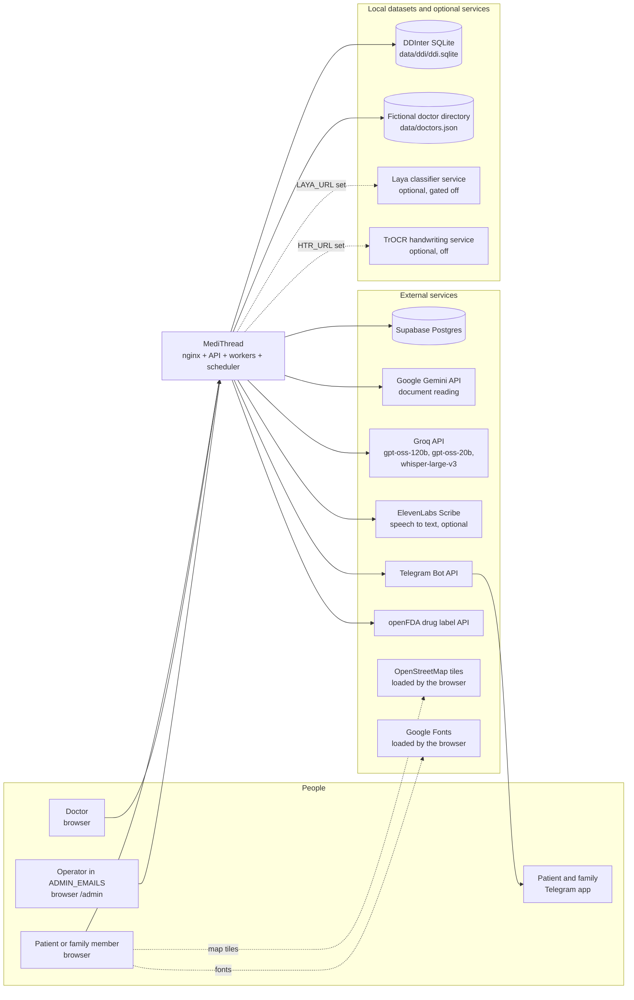

Evidence:

- Supabase: `app/database.py`, `DATABASE_URL`.
- Gemini: `ai/extractor.py`.
- Groq: `ai/consultation.py`, `ai/translator.py`, `ai/health_review.py`, `ai/doctor_ai.py`, `ai/transcribe.py`, `app/agent/llm.py`.
- ElevenLabs: `app/speech.py`. Speech to text only. There is no server-side text to speech: the "Read aloud" button uses the browser's `SpeechSynthesisUtterance` in `Frontend/src/components/console/ApprovedPanel.jsx`.
- Telegram: `ai/telegram.py`.
- openFDA: `ai/drug_usage.py`, plus `ai/safety.py::_openfda_check`, which is off unless `OPENFDA_ENABLE=1`.
- DDInter: `ai/ddi.py`, built by `scripts/build_ddi.py`.
- Laya: `ai/decision.py`, `laya/app.py`.
- TrOCR: `ai/htr.py`, `htr/app.py`.
- Tiles and fonts: `Frontend/src/pages/Doctors.jsx`, `Frontend/index.html`, and the nginx CSP in `deploy/nginx/snippets/security.conf`.

---

## 3. High-Level Architecture

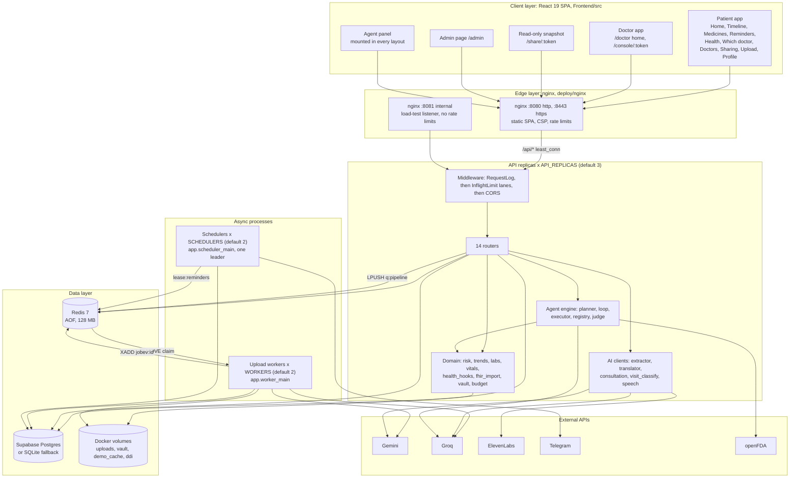

Evidence: `docker-compose.yml`, `deploy/nginx/nginx.conf`, `deploy/nginx/snippets/app.conf`, `BackEnd/app/main.py`, `app/worker_main.py`, `app/scheduler_main.py`.

---

## 4. Component Architecture

Each component below lists its responsibility, inputs and outputs (I/O), dependencies, whether it runs synchronously or asynchronously, how it fails, and how it scales. All rows are Implemented unless labelled.

| Component | File(s) | Responsibility | I/O | Depends on | Sync / async | Failure modes | Scaling |
| --- | --- | --- | --- | --- | --- | --- | --- |
| nginx | `deploy/nginx/*` | TLS, static SPA, `/api` proxy, rate limits, CSP, JSON access log with redaction, least-connections LB | HTTP in, HTTP out | Docker DNS `127.0.0.11` | sync | A dead upstream copy is skipped after 2 failures for 10 s. Idempotent requests are retried on another copy. | One container, not replicated: **single point of failure** (Inferred from implementation) |
| `RequestLogMiddleware` | `app/observability.py` | Request id, `X-Served-By`, one JSON log line, slow-request warning, metric recording | ASGI | `metrics` | sync per request | Never raises into the request | per process |
| `InflightLimit` | `app/concurrency.py` | Two bulkhead lanes (`fast`, `ai`), queueing, 503 shedding | ASGI | asyncio | async | 503 + `Retry-After: 2` when the wait queue exceeds 200 or the wait exceeds 15 s | per process, limits set by env |
| Auth | `app/auth.py`, `routers/auth.py` | scrypt passwords, HS256 JWT, role dependencies, login lockout | JSON | DB, store | sync | 401, 429 | stateless |
| Patients router | `routers/patients.py` | Timeline, alerts, insights, medicines, reminders, profile, home readings, health check | JSON | DB, risk, health_review, store | sync | 401, 422; the AI review falls back to rules | stateless |
| Documents router | `routers/documents.py` | Upload (size, magic bytes, budget), job status, SSE stream, triage | multipart in, SSE out | pipeline, jobqueue, decision | upload sync, SSE async | 400, 413, 415, 429; the stream ends on `done` or `error` | stateless in queue mode; in-process mode keeps jobs in memory |
| Upload pipeline | `ai/pipeline.py` | Stages read, understand, code, explain, check; persistence; cache | bytes in, DB rows + events out | extractor, safety, translator, health_hooks | sync, in worker or thread | `ExtractError` text becomes an `error` event; any other error becomes a generic error event | per worker |
| Job queue | `app/jobqueue.py` | Redis list queue, processing lists, heartbeats, streams, orphan requeue | Redis | `store._redis` plus a blocking client | async | Redis down at runtime: the calls raise (no fallback in this module) | Redis-bound |
| Worker | `app/worker_main.py` | Claim, process, finish, janitor every 15 s | Redis jobs | pipeline | async to the API | Crash: its jobs are requeued by a live worker's janitor (at most 2 attempts) | `WORKERS` replicas |
| Scheduler | `app/reminder_service.py`, `app/scheduler_main.py` | 30 s tick, lease, dose, nudge, missed-dose, refill and appointment messages | DB in, Telegram out | APScheduler, store lease | async background | Exceptions are caught per tick. A Telegram failure is not counted as sent. | Active/standby through the lease |
| Consultation router | `routers/consultations.py` | Visit lines, audio, flags, partial SOAP, finalize, approve | JSON / multipart | consultation AI, visit_classify, speech, safety, Laya | sync | AI failure: empty SOAP, classification None, fallback extraction | stateless (state is in the DB) |
| Agent engine | `app/agent/*` | Plan, loop, execute tools, judge, tasks, memory | JSON | Groq, executor, store, DB | inline, or a background thread for slow steps | LLM down: rule planner. Tool failure: an error block. | per process. **Background agent tasks are lost if their copy dies** (README "Known limits") |
| Vault | `app/vault.py` | AES-256-GCM file storage | bytes | `FILE_ENC_KEY`, volume | sync | No key: 503 (fails closed) | shared volume |
| Breakers | `app/breaker.py` | Per-provider circuit state, shared through the store | n/a | store | sync | Store falls back to memory, which makes breakers per process | shared through Redis |
| Metrics | `app/metrics.py` | 5 s buckets in Redis, API heartbeats, `live()` | n/a | Redis | 2 s background thread | Swallows all errors | per process |
| Risk and trends | `app/risk.py`, `app/trends.py` | Whole-record danger checks and rising-value alerts | Observations in, Alerts out | DB | sync | n/a (pure Python) | n/a |
| FHIR import | `app/fhir_import.py` | Parse a Bundle, dedupe by `external_id`, run the same checks, Groq summary for at most 12 cards | JSON in | safety, translator, health_hooks | sync, in the threadpool | 400 / 413 plain errors | stateless |
| Doctor finder | `app/doctors.py`, `ai/doctor_ai.py` | Rank the fictional directory in Python; the AI explains and parses only | query in | `doctors.json`, Groq | sync | AI failure: template text | stateless (LRU-cached file) |
| Static site | `app/static_site.py` | Serves the SPA from the API process when `STATIC_DIR` exists (Render) | HTTP | filesystem | sync | `api/...` always gives 404 JSON | n/a |

---

## 5. Frontend Architecture

**Implemented** (`Frontend/`):

- **Stack**: React 19, react-router-dom 7, Vite 8, GSAP, Lenis, Leaflet, qrcode.react (`Frontend/package.json`).
- **Router** (`src/main.jsx`, `src/App.jsx`): `BrowserRouter`, or `HashRouter` in the offline single-file build (`VITE_SINGLE`).
  - Routes `/login`, `/share/:token` and `/console/:token` sit outside the login guard.
  - `/doctor` uses `DoctorLayout`, which needs `role === "doctor"` in the stored profile.
  - Every other route uses `Layout`. It needs a token and redirects doctors to `/doctor`.
  - `/admin` sits inside the patient `Layout` (see Section 28).
- **API contract**: `src/api/client.js` is the only module that calls the backend.
  - It uses `fetch` with `Authorization: Bearer <token>`. The token lives in `localStorage.medithread_token`. A 401 clears it and redirects to the login page.
  - Upload progress uses `EventSource`, which cannot send headers, so the job id in the URL is the credential.
  - Consultation calls send `X-Share-Token` instead of the JWT.
- **Mock mode**: `VITE_USE_MOCK=true` makes every client function return data from `src/data/mockData.js`. `npm run build:single` produces one offline HTML file pinned to mock mode (`vite.config.js`).
- **Agent panel** (`src/components/agent/`): mounted by `Layout`, `DoctorLayout` and `DoctorConsole`. The panel itself is lazy-loaded.
  - Typed requests go to `/api/agent/chat` or `/api/doctor-agent/chat`.
  - Quick-action buttons run local, read-only summaries built from the patient API (`agentActions.js`, cached for 45 s in `agentData.js`).
  - Slow tasks are polled every 1 s, up to 90 times. Confirmations call `/confirm`.
  - Voice goes through `useVoice.js` (`MediaRecorder`) to `/api/agent/voice`. The text comes back into the input box and is never sent automatically.
- **Doctor console** (`src/pages/DoctorConsole.jsx`, `src/components/console/`): four phases, history → recording → review → approved.
  - `useWhisperRecorder.js`: a single `MediaRecorder` with an RMS voice detector. It cuts a clip after 900 ms of silence or 14 s of audio, throws away clips with under 300 ms of speech, and uploads clips strictly in order with up to 3 tries each. A 503 switches to browser `SpeechRecognition` (`useSpeechRecognition.js`).
  - Typed lines and browser-recognised lines use a separate serial retry queue in `RecordingPanel.jsx`.
- **Tour** (`src/components/tour/`): a CSS-selector-driven guided tour and auto demo, held in a global store.

---

## 6. Backend Architecture

```mermaid
flowchart TB
  subgraph ASGI["One API process: app/main.py"]
    direction TB
    L1["RequestLogMiddleware<br/>request id, X-Served-By, JSON log, metrics.record"]
    L2["InflightLimit<br/>fast lane MAX_INFLIGHT, ai lane MAX_AI_INFLIGHT,<br/>MAX_WAITING 200, QUEUE_TIMEOUT 15 s"]
    L3["CORSMiddleware<br/>CORS_ORIGINS or the localhost dev origins"]
    L1 --> L2 --> L3
    subgraph Routers["app/routers"]
      R1["auth /api/auth"]
      R2["patients /api/patients/me"]
      R3["shares /api/shares"]
      R4["documents /api/documents, /api/jobs, /api/triage"]
      R5["consultations /api/consultations"]
      R6["reminders /api/reminders, /api/demo/fire-*"]
      R7["imports /api/import/fhir"]
      R8["demo /api/demo/reset, /api/health/deep"]
      R9["care /api/care"]
      R10["doctor /api/doctor"]
      R11["doctors /api/doctors"]
      R12["agent /api/agent"]
      R13["doctor_agent /api/doctor-agent"]
      R14["admin /api/admin"]
    end
    L3 --> Routers
    subgraph Domain["app: plain Python"]
      D1["risk.py, trends.py, labs.py, vitals.py"]
      D2["health_hooks.after_new_data"]
      D3["fhir_import.py"]
      D4["vault.py AES-256-GCM"]
      D5["budget.py, store.py, breaker.py"]
      D6["reminder_service.py"]
      D7["doctors.py ranking"]
    end
    subgraph AI["ai: model-facing code"]
      A1["extractor.py + handwriting.py + htr.py"]
      A2["pipeline.py"]
      A3["safety.py + ddi.py"]
      A4["translator.py, health_review.py"]
      A5["consultation.py, visit_classify.py"]
      A6["transcribe.py, medterms.py"]
      A7["decision.py + triage_rules.py + laya_schema.py"]
      A8["doctor_ai.py, drug_usage.py, telegram.py"]
    end
    subgraph Agent["app/agent"]
      G1["engine.py"]
      G2["planner.py"]
      G3["loop.py"]
      G4["executor.py"]
      G5["registry.py + tools/*"]
      G6["permissions.py, validate.py"]
      G7["judge.py, llm.py"]
      G8["tasks.py, memory.py, audit.py, formatter.py"]
      G9["extract.py, ingest.py, pdfgen.py"]
    end
    Routers --> Domain
    Routers --> AI
    Routers --> Agent
    Agent --> Domain
    Agent --> AI
  end
```

**Endpoint inventory** (Implemented; the full route list is in the router files):

| Router | Endpoints | Auth |
| --- | --- | --- |
| auth | `GET /config`, `POST /register`, `POST /login`, `GET /me`, `POST /otp/request` and `/otp/verify` (404 unless `DEMO_MODE`) | none, or any JWT for `/me` |
| patients | `GET ""`, `/timeline`, `/alerts`, `/insights`, `/medicines`, `/reminders`, `POST /reminders/{key}/taken`, `GET /access-log`, `/family`, `PUT ""`, `POST /vitals`, `GET /health-check` | patient JWT |
| shares | `POST ""` (patient JWT); `GET /{token}/snapshot` (**no JWT**: the share token is the credential) | mixed |
| documents | `POST /documents` (patient JWT); `GET /jobs/{id}` and `/jobs/{id}/events` (**no JWT**: the job id is the credential); `POST /triage` (**no JWT**) | mixed |
| consultations | `POST /start` (share token in the body); `/{id}/line`, `/{id}/audio`, `/{id}/finalize`, `/{id}/approve`, `GET /{id}`, `POST /demo/{id}` (`X-Share-Token` header) | share token |
| reminders | `GET/PUT /reminders/settings`, `POST /reminders/telegram/test`, `/reminders/{key}/taken`, `/demo/fire-reminder`, `/demo/fire-missed` | patient JWT |
| imports | `GET /import/fhir/sample`, `POST /import/fhir` | patient JWT |
| care | `POST /invite`, `GET /doctors`, `DELETE /doctors/{link_id}` | patient JWT |
| doctor | `POST /link`, `GET /patients`, `GET /patients/{pid}/snapshot`, `POST /patients/{pid}/console-token` | doctor JWT plus an active care link |
| doctors | `GET /cities` (public), `GET /nearby`, `POST /ask`, `GET /recommend` | patient JWT |
| agent | `POST /chat`, `/confirm`; `GET /tools`, `/history`, `/tasks`, `/tasks/{id}`, `/files`, `/files/{id}/content`, `/shares/{ref}`; `POST /tasks/{id}/cancel`, `/files`, `/files/{id}/type`, `/voice`; `DELETE /files/{id}` | patient JWT |
| doctor_agent | `/chat`, `/confirm`, `/tasks/{id}`, `/tasks/{id}/cancel`, `/files`, `/voice`, `/files/{id}/content`, `/history`, `/tools` | doctor JWT plus a care link on every call |
| admin | `GET /metrics`, `GET /live` | any JWT whose user email is in `ADMIN_EMAILS`; 404 otherwise |
| main | `/health`, `/api/health`, `/api/health/ready` | none |

**Thread model** (Inferred from implementation):

- Most handlers are `def`, so FastAPI runs them in the anyio worker-thread pool (default 40 threads). Each one holds one SQLAlchemy session from `get_db` until the response is sent.
- `POST /api/documents` is `async def` and calls `pipeline.start_job` directly, so its file write and duplicate-check query run on the event loop.
- The queue-mode SSE stream polls Redis with `asyncio.to_thread(XREAD BLOCK 15000)`, so each open stream holds a pool thread for up to 15 s at a time. `/api/jobs/` is exempt from `InflightLimit`.

---

## 7. AI Agent Architecture

### 7.1 One engine, two agents

`AgentEngine` (`app/agent/engine.py`) serves both agents. The routers build an `AgentContext` (`app/agent/context.py`) only from the verified JWT:

- `routers/agent.py::patient_ctx`: `actor_id = patient_id` = the patient's own id.
- `routers/doctor_agent.py::doctor_ctx`: `actor_id` = the doctor's user id. `patient_id` is taken from the request only after an **active** `CareLink` is found; otherwise the route answers 404.

`scope` is always `"full"` in both contexts. The share-scope rules in `permissions.py` exist, but no route builds a narrower agent context (Inferred from implementation).

### 7.2 Request path

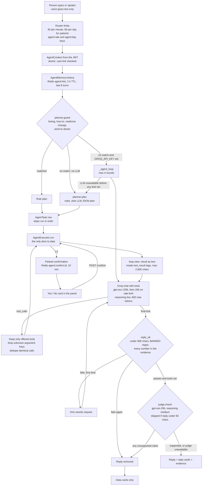

Evidence:

- `engine.py::chat`, `_agent_start`, `_agent_loop`, `_run` and `confirm`.
- `loop.py`: `MAX_ROUNDS = 4`, `MAX_VIEW_CHARS = 2600`, `reply_ok` (900-char limit), `numbers_ok`, `may_chain`, `CHAINS`.
- `judge.py`: `MIN_REPLY = 60`, `MAX_EVIDENCE = 3500`.
- `llm.py::_groq_chat` and `_groq_judge`.
- `planner.py::guard`, `plan`, `_rules`, `_llm`.

**THE LLM DOES NOT ACCESS THE DATABASE** (Implemented):

- `llm.py` holds no database session.
- The only thing the model returns that the system acts on is `tool_calls`, a list of function names plus JSON argument strings.
- `engine._agent_loop` maps every name through `by_fn`, which holds only the tools offered for this role. Anything else goes to `executor.run(ctx, "unknown.tool", {})`, which returns `unknown_tool` and writes an audit row.
- Tool handlers receive the server-built `ctx`. The model never supplies `patient_id` or `actor_id`.

### 7.3 Registered tools (46): Implemented, enumerated from the `@tool(...)` decorators in `app/agent/tools/*.py`

| Group | Tool | Level | Roles | Permission | Notes |
| --- | --- | --- | --- | --- | --- |
| Record reads | `timeline.list`, `documents.search`, `documents.get` | L1 | patient, doctor | records:read | Document queries filtered by scope |
| Medicine reads | `medications.list`, `medications.check_interactions` | L1 | patient, doctor | meds:read | Interactions use curated pairs plus DDInter |
| | `medications.side_effects` | L1 (slow) | patient, doctor | meds:read | openFDA label; the quotes are checked by `verify_items` |
| | `medications.unclear`, `medications.usage_lookup` (slow) | L1 | patient | meds:read | |
| Health reads | `health.latest`, `health.trend`, `health.conditions`, `health.allergies`, `health.alerts`, `health.risks` | L1 | patient, doctor | health:read | `health.alerts` hides `handwriting` alerts from doctors |
| Care loop reads | `careloop.due`, `careloop.history` | L1 | patient, doctor | careloop:read | |
| Discovery | `doctors.search` | L1 | patient | doctors:read | Fictional directory |
| | `sharing.active` | L1 | patient | sharing:read | Returns a hashed ref, never the token |
| Guidance (L2) | `navigation.navigate`, `visit.prepare`, `app.help`, `app.tour` | L2 | patient, doctor | nav:use / health:read | `navigate` accepts only known routes for the role |
| | `triage.check` | L2 | patient | health:read | Calls the same triage function as `/api/triage` (rules first) |
| Files (L2 drafts) | `documents.extract` (slow) | L2 | patient, doctor | records:read | Writes only to `agent_files.extraction`, never to the timeline |
| | `documents.entities`, `documents.evidence` | L1 | patient, doctor | records:read | |
| | `documents.summarize`, `documents.compare` | L2 | patient, doctor | records:read | |
| PDF | `pdf.generate`, `pdf.preview` | L2 | patient, doctor | pdf:create | Kind restricted by role (`BY_ROLE`); encrypted in the vault; 24 h expiry |
| Doctor | `doctor.changes_since_visit`, `doctor.record_conflicts`, `doctor.missing_info` | L1 | doctor | records:read | Conflicts are only flagged as "Please verify" |
| | `doctor.brief` | L2 | doctor | records:read | |
| | `consult.draft_from_notes` (slow) | L2 | doctor | consult:draft | Creates an 8 h share link and a consultation in `draft` status; nothing reaches the timeline |
| **Writes (L3)** | `records.add_from_file`, `health.log_reading`, `medications.confirm_unclear`, `medications.update`, `medications.add_usual_timing` (slow) | L3 | patient | records:write | Each has a `preview` and a `verify` |
| | `sharing.create`, `sharing.revoke`, `care.revoke_doctor` | L3 | patient | sharing:write | |
| | `careloop.mark_taken`, `reminders.setup_telegram` | L3 | patient | careloop:write | |
| | `consult.approve_draft` | L3 | doctor | consult:approve | Calls the same `approve` the console uses |

### 7.4 Permission levels (`app/agent/types.py`, `registry.py`, `executor.py`)

| Level | Meaning in code | Enforcement |
| --- | --- | --- |
| **L1** | Read only | Runs at once after schema and permission checks |
| **L2** | Reversible or low risk: navigation, drafts, summaries, PDFs, extraction into a draft | Runs at once; must not write to the health thread |
| **L3** | Writes to data | `registry.register` refuses an L3 tool registered without `confirmation_required`. `executor.run` parks every L3 call until `/confirm`. |
| **L4** | Clinically serious | `executor.run` returns `denied` for any level of 4 or more. **No L4 tool is registered**, so this check is defensive. |

**Deliberately missing tools: a security boundary** (Implemented, but narrower than the project's own wording; see Section 28):

- There is **no tool that starts a new medicine of the agent's choosing, stops or deactivates a medicine, or switches one drug for another.**
  - Requests matching `R_MED_CHANGE` in `planner.py` ("stop / skip / double / increase / reduce / change / switch / start" near a medicine word) are caught by `guard()` **before any model call**. They get a fixed refusal plus the medicine list.
  - `medications.update` has no `active` field, so it cannot stop a medicine.
- **However:** `medications.update` (L3) *can* set the `dose`, `frequency`, `times`, `duration_days` and `instructions` of a medicine the patient already has, after the patient confirms a preview. `medications.confirm_unclear` (L3) and `records.add_from_file` (L3) add medicines, but only names that came from a document the patient uploaded.
  - So the accurate statement is: the agent cannot prescribe, stop or switch a medicine. With the patient's explicit Yes it can edit the details of an existing medicine or add medicines taken from the patient's own documents.
  - A phrase such as "set telma to 80 mg" does not match `R_MED_CHANGE` (there is no "set" verb in it), so it reaches the LLM loop. The patient's confirmation is the remaining safeguard (Inferred from implementation).
- There is **no tool that sends anything to a doctor** (`R_SEND` gives a fixed answer explaining this).
- The doctor agent has **no tool that writes to the patient record**, except `consult.approve_draft`.

### 7.5 Tasks, memory and audit

- **Tasks** (`app/agent/tasks.py`, table `agent_tasks`): states queued, running, waiting_for_confirmation, completed, failed and cancelled; `planning` is defined but never set.
  - A plan with a `slow` step, or an LLM loop with an attached file, runs in `threading.Thread(daemon=True)` with its own session. The browser polls the task.
  - Tasks older than 30 days are purged at startup.
  - **These threads die with their API process.** No requeue exists (NOT IMPLEMENTED; documented in the README).
- **Memory** (`app/agent/memory.py`): Redis keys `agent:hist:{role}:{actor}:{conv}` and `agent:sess:...` with a 2 h TTL and the last 8 turns.
  - The rule path stores the user's text plus the intent label.
  - The LLM loop stores the user's text plus `[did: tool(args...)]` plus the checked reply.
  - Raw tool output is never stored there.
- **Audit** (`app/agent/audit.py`, table `agent_audit`): one row per tool call attempt, covering denied, invalid, failed, needs_confirmation, declined and ok. Each row holds ids, the level, the status, a confirmed flag and a short detail. A failed audit write is logged and does not break the request.

---

## 8. Tool Execution Architecture

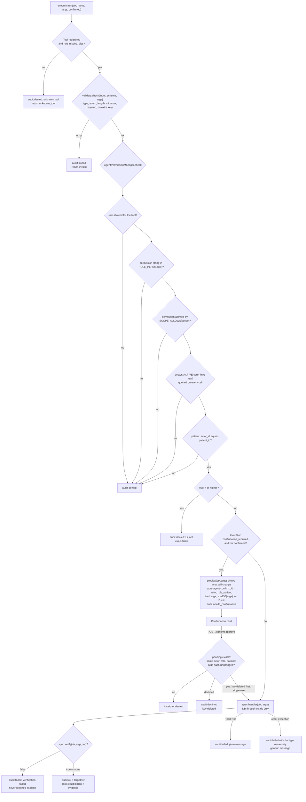

Evidence: `app/agent/executor.py`, `permissions.py`, `validate.py`, `registry.py`.

The role permission sets (`permissions.py`):

- **Patient**: records:read/write, meds:read, health:read, careloop:read/write, doctors:read, sharing:read/write, nav:use, pdf:create, profile:read.
- **Doctor**: records:read, meds:read, health:read, careloop:read, nav:use, pdf:create, consult:draft, consult:approve. **A doctor has no `records:write`, `sharing:write` or `careloop:write`.**

`verify` examples (Implemented, `tools/writes.py`):

- `sharing.create` checks that the new `ShareLink` exists.
- `sharing.revoke` checks that every revoked token is gone.
- `health.log_reading` checks that the `Document` exists for this patient.
- `careloop.mark_taken` checks the store key.
- `medications.update` re-reads every changed column.
- `consult.approve_draft` checks `status == "approved"`.
- `pdf.generate` decrypts the stored file and checks it starts with `%PDF-`.

---

## 9. Medical Document Pipeline

There are **two ingestion paths** with different validation strength. The difference matters, so the two are described separately.

| | Path A: upload (`POST /api/documents`) | Path B: agent file (`POST /api/agent/files` → `documents.extract` → `records.add_from_file`) |
| --- | --- | --- |
| Storage of raw bytes | Plain file on the `uploads` volume, named `sha256[:16].ext` (`ai/pipeline.py::_save_upload`). **Not encrypted.** | AES-256-GCM in the `vault` volume, under a random storage key, with AAD = `file_id:patient_id` (`app/vault.py`) |
| Extraction | Gemini (`ai/extractor.py`), plus the handwriting second pass | The same Gemini extractor, then `app/agent/extract.py::verify` |
| Per-value provenance | **None per value.** The document keeps `source_lines`, the model's transcription of the page. | Every kept value carries `{lines, page, quote}` |
| Unfound values | Saved as Gemini returned them | Moved to `unverified` and left out of `cleanDoc` |
| Human confirmation before saving | No: the upload itself is the action | Yes: L3 confirmation with a preview |
| Persistence code | `pipeline._run_sync` | `pipeline._run_sync(doc=cleanDoc)`, the same code, which skips the Gemini call |

### 9.1 Pipeline diagram

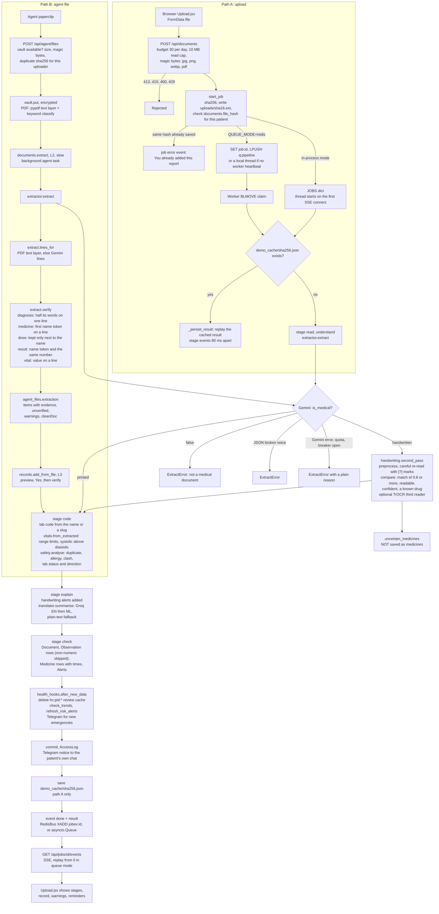

### 9.2 Where an extracted value can be rejected or held back (Implemented)

| Point | File | What happens |
| --- | --- | --- |
| Request checks | `routers/documents.py` | Empty, over 10 MB, wrong magic bytes, or daily upload budget used: an HTTP error and nothing is stored |
| Duplicate file | `pipeline.start_job` | The same SHA-256 already saved for this patient: an `error` event |
| Not medical / broken JSON / provider failure | `extractor.extract` | `ExtractError` with a plain message: an `error` event, nothing saved |
| Handwriting disagreement | `handwriting.compare` | The medicine goes to `uncertain_medicines`. It becomes an `Alert(kind="handwriting")` with the details in `data`, **never a `Medicine` row**. The patient can later confirm it through `medications.confirm_unclear` (L3). |
| Second read failed | `handwriting.second_pass` | **Every** handwritten medicine becomes uncertain |
| TrOCR third reader | `handwriting._third_reader` | Only demotes a medicine to uncertain (no dose written and the name not seen); never promotes one |
| Vital out of range | `vitals.from_extracted` | Dropped. For example blood pressure needs 50–300 systolic, 30–200 diastolic, and systolic above diastolic. |
| Non-numeric lab value | `pipeline._run_sync` | No `Observation` row (it can still appear in the card's `items`) |
| Path B: value not in the document text | `agent/extract.py::verify` | Goes to `unverified`, is excluded from `cleanDoc`, and is shown as "left out" |
| Path B: dose not next to the name | `agent/extract.py::verify` | The dose is set to `None`; the medicine is kept |
| Path B: type unclear or disagreeing | `extract.classification_check` | The type becomes `None`, and `records.add_from_file` refuses until the person picks a type |
| Path B: injection-looking text | `extract.INJECTION` | A warning is added and the text is treated as plain data |

**State vocabulary** (Inferred from implementation):

- **verified**: Path B items that carry evidence.
- **unverified**: Path B values not found in the source. Kept on `agent_files.extraction`, never written.
- **uncertain / unclear**: handwritten medicine names. Stored only as an alert.
- **rejected**: the validation failures in the table above.
- **persisted medical data**: `documents`, `observations`, `medicines` and `alerts` rows. Path A persists everything Gemini returned that passed the checks above, without per-value source matching.

### 9.3 Cache invalidation (Implemented)

- `after_new_data` deletes every `hc:{patient_id}:*` key, the cached AI health review. That is the only explicit invalidation on new data.
- `ai/health_review.py::_CACHE` is an in-process dict keyed by a hash of the review input facts. A changed record gives a new key, so no deletion is needed (Inferred).
- `demo_cache/{sha256}.json` is **never invalidated**. It is keyed by the file hash only, **not by patient**. If patient B uploads a file whose result was cached for patient A, the cached alerts and summary computed against A's medicines and allergies are written to B's record (`_persist_result` drops only `trend` alerts) (Inferred from implementation; see Section 28).

---

## 10. Database Architecture

**Engine** (`app/database.py`):

- `DATABASE_URL` is rewritten to `postgresql+psycopg2`. With `DB_POOL_MODE=transaction`, port `:5432` becomes `:6543`, Supabase's transaction pooler.
- Pool: 20 + 20 by default in transaction mode, otherwise 3 + 2. Docker sets 8 + 8 per API copy, 3 + 2 per worker and 2 + 1 per scheduler. `pool_pre_ping`, `pool_recycle=300`, `pool_timeout=15`, `connect_timeout=8`.
- If Postgres is unreachable **at startup**, the process falls back to `BackEnd/medithread.db` (SQLite). There is no fallback at runtime.
- **Schema management**: `Base.metadata.create_all`, then `add_missing_columns()` (only `ALTER TABLE ADD COLUMN` for nullable columns), then `add_missing_indexes()`. **No migration tool** such as Alembic (NOT IMPLEMENTED).

### 10.1 Entity relationships (from `app/models.py`, foreign keys as declared)

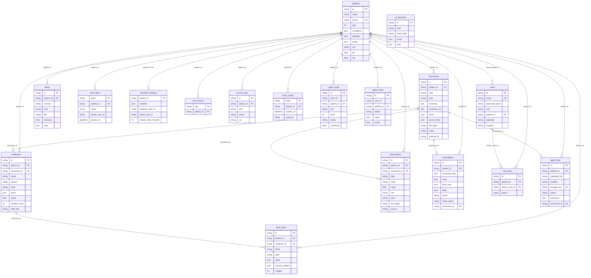

Notes (Implemented):

- `ai_decisions` has no foreign key.
- `share_links.doctor_user_id` is a plain string column, not a foreign key.
- No ORM `relationship()` is declared, which is why `consultations.approve` must `flush()` the new Document before inserting rows that point at it (the comment in `routers/consultations.py`).
- **Unique constraints**: `patients.phone`, `users.email` and `agent_files.storage_key` only. In particular **there is no unique constraint on `sent_doses(medicine_id, clock, date)`** and none on `documents(patient_id, file_hash)`.
- **Indexes**: single-column `index=True` on most `patient_id` columns plus `documents.file_hash`, `documents.external_id`, `consultations.share_token`, `share_links.doctor_user_id`, `agent_audit.request_id/tool`, `ai_decisions.kind/input_hash`, `agent_tasks.status`. Composite (created at startup): `documents(patient_id, date)`, `observations(patient_id, date)`, `alerts(patient_id, resolved)`, `agent_audit(actor_id)`.
- **JSON-heavy columns**: conditions, allergies, items, source lines, transcripts, SOAP, flags, steps and results are stored as JSON, not normalised.

---

## 11. Redis Architecture

Redis 7 (`docker-compose.yml`): `--appendonly yes`, `--maxmemory 128mb`, `--maxmemory-policy volatile-lru`, no published port.

The generic key-value access goes through `app/store.py`. It retries the connection 5 times at start. At runtime, `_redis_call` **falls back to an in-memory dict for that call** when Redis raises. The modules `jobqueue.py`, `metrics.py` and `autoscale.py` use the raw client directly and have no such fallback.

| Key pattern | Type | TTL | Writer | Purpose |
| --- | --- | --- | --- | --- |
| `q:pipeline` | list | none | API `LPUSH` | Upload job queue |
| `q:processing:{worker}` | list | none | worker `BLMOVE` | Jobs held by one worker |
| `job:{id}` | string (JSON) | 1 h | API, worker | Job state and result |
| `jobev:{id}` | stream, `MAXLEN ~200` | 1 h | worker `XADD` | Progress events for SSE |
| `hb:worker:{host}` | string | 20 s | worker, every 5 s | Liveness and counters |
| `hb:api:{host}` | string | 10 s | API, every 2 s | Lane snapshot |
| `hb:scheduler:{instance}` | string | 90 s | scheduler | leader or standby |
| `lease:reminders` | string | 90 s | scheduler, Lua take-or-renew | Leader election |
| `m:{epoch5s}` | hash | 900 s | API metrics flush | req, ms, latency histogram, e5, e429, shed |
| `cb:{name}` | string (JSON) | 3600 s | `breaker.py` | Circuit breaker state |
| `agent:confirm:{cid}` | string | 600 s | executor | Pending L3 action plus argument hash |
| `agent:qr:{pid}:{ref}` | string | 900 s | `sharing.create` | Share URL fetched once by the UI (keeps the token out of task results) |
| `agent:hist:*`, `agent:sess:*` | string | 7,200 s | AgentMemory | Short conversation memory |
| `agent:rate:{actor}:{min}`, `agent:day:{actor}:{date}` | counter as string | 90 s, 25 h | agent router | Rate limit and daily budget |
| `budget:{feature}:{actor}:{date}` | counter as string | 25 h | `budget.py` | Uploads, doctor AI, review budgets |
| `loginfail:{email}:{ip}` | counter as string | 15 min | auth | Login lockout after 5 failures |
| `badcode:{doctor}` | counter as string | 15 min | doctor router | Invite-code lockout after 10 failures |
| `otp:{phone}` | string | 300 s | demo OTP | Demo login only |
| `taken:{pid}:{date}:{key}` | string | 3 days | mark_taken | Dose-taken state (the source of truth for the reminders list) |
| `dose:{med}@{HH:MM}@{date}` | string | 2 days | scheduler | Fast "already sent" check (the DB is also checked) |
| `hc:{pid}:{fingerprint}` | string (JSON) | 120 s | health-check route | AI review cache |
| `laya:{model}:{sha256}` | string | 24 h | `ai/decision.py` | Laya answer cache |
| `tok:{date}:{feature}:{model}` | string (JSON) | 8 days | `tokens.py` | Token meter |

Notes (Inferred from implementation):

- **Counters are read-modify-write** (`get_value` then `set_value`), not `INCR`. Concurrent requests can under-count rate limits, budgets and lockouts.
- `breaker._read` and `_write` are also read-modify-write. They have a 1 s local read cache.
- Under `volatile-lru`, only keys with a TTL can be evicted. The queue lists have no TTL, so they cannot be evicted. If memory is full of keys without a TTL, writes fail.

---

## 12. Queue and Worker Architecture

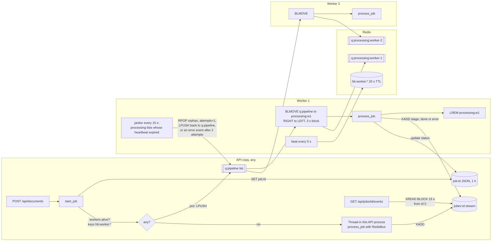

Queue semantics (Implemented, `app/jobqueue.py`, `app/worker_main.py`):

- **Claim**: `BLMOVE q:pipeline q:processing:{worker} RIGHT LEFT`. A single atomic Redis command, so **two workers cannot claim the same queued job**.
- **Delivery**: at least once.
  - A worker restarting with the same hostname requeues its own leftover processing list.
  - Any live worker's janitor requeues the processing lists of workers whose heartbeat key has expired (20 s TTL), and increments `attempts`.
  - After `MAX_ATTEMPTS = 2`, an error event is sent instead.
- **Idempotency**: **partial**.
  - The duplicate check (`documents.file_hash` for this patient) runs only in `start_job`, before the job is queued, and in `_persist_result` (the cached-replay path).
  - `_run_sync` does not re-check, so a job that saved its rows and then lost its worker before `LREM` can be processed again and **saved twice**. The README admits this ("rarely, save the record twice"). No unique constraint prevents it.
- **Progress**: Redis Streams. The SSE handler always starts from id `0`, so a reconnecting browser, or a browser that lands on a different API copy, replays every stage.
  - **However**, the frontend `EventSource.onerror` closes the stream and shows an error (`api/client.js`). The browser never reconnects on its own (Inferred from implementation).
- **Worker concurrency**: one job at a time per worker process (a single loop).
- **In-process mode** (`QUEUE_MODE` unset: Render, local uvicorn): jobs live in the `pipeline.JOBS` dict. The job thread starts when the **first SSE listener connects** (`run_async`).
  - A job whose browser never opens the stream never runs.
  - A second listener that connects while the job is running gets a new empty queue that the running thread does not feed, so it receives only keepalives until the 300 s nginx timeout (Inferred from implementation).

---

## 13. Authentication and Authorization

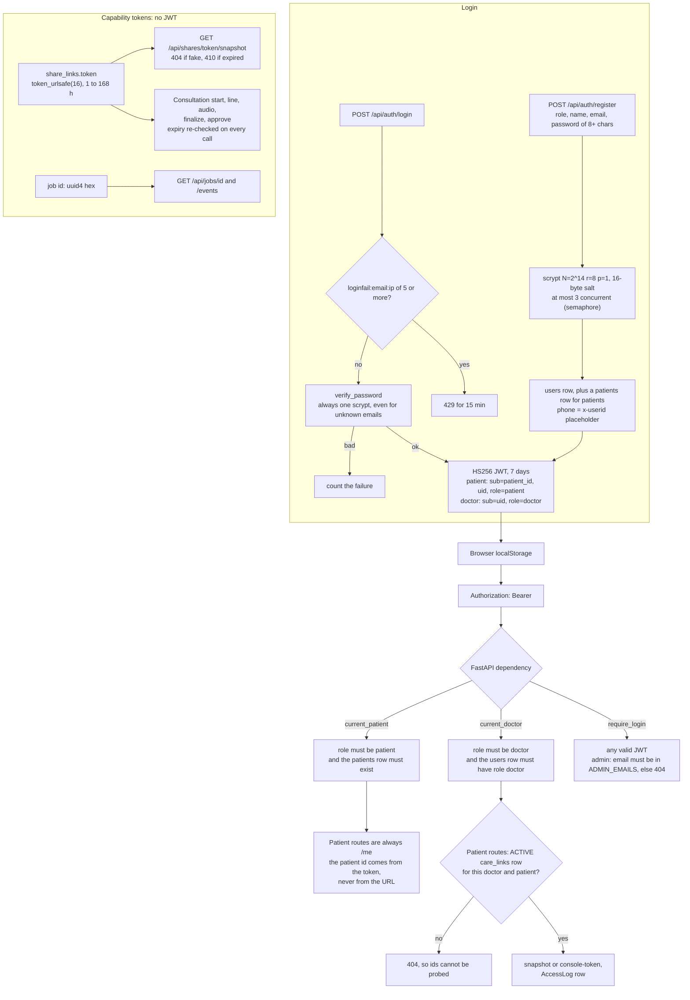

Implemented in `app/auth.py`, `routers/auth.py`, `routers/doctor.py`, `routers/care.py`, `routers/shares.py`, `routers/consultations.py::_authorize`, `routers/admin.py::admin_user`.

**Care-link lifecycle**:

1. The patient calls `POST /api/care/invite`: an 8-character code from a 32-character alphabet, valid 24 h. Older unused codes are deleted, so only one is live.
2. The doctor calls `POST /api/doctor/link`. Ten bad codes lock it for 15 min. The code is marked used and a `CareLink` is set to `active`.
3. Revoke: `DELETE /api/care/doctors/{link_id}` sets `status = "revoked"`, **deletes that doctor's share links** (which kills their console sessions, because every consultation call re-checks the share link), and writes an `AccessLog` row.

**What is NOT implemented**: server-side logout or token revocation (logout only clears localStorage); refresh tokens; email verification; password reset; MFA. JWTs stay valid for 7 days. The README states the email verification and password reset gaps.

---

## 14. Security Model

```mermaid
flowchart LR
  subgraph Edge["nginx"]
    E1["TLS 1.2/1.3, self-signed certificate"]
    E2["Rate limits: auth 10 per min,<br/>uploads 20 per min, general 30 per s,<br/>40 connections per IP"]
    E3["Body caps: 1 MB default,<br/>11 MB uploads, 3 MB FHIR"]
    E4["CSP: script-src self,<br/>frame-ancestors none,<br/>X-Frame-Options DENY, HSTS, nosniff"]
    E5["Access log redacts share tokens<br/>and job ids, no query strings"]
  end
  subgraph App["API"]
    A1["JWT role separation"]
    A2["Ownership: patient routes use /me"]
    A3["Care link checked per request<br/>and per agent tool call"]
    A4["Pydantic bodies<br/>agent tool schemas"]
    A5["Magic-byte file checks<br/>upload and audio"]
    A6["Login and invite lockouts<br/>daily AI budgets"]
    A7["Agent: executor, L3 confirmation, verify, audit"]
  end
  subgraph DataSec["Data at rest"]
    D1["Agent files: AES-256-GCM,<br/>AAD file:patient, random key name,<br/>fail closed without FILE_ENC_KEY"]
    D2["Passwords: scrypt"]
    D3["Uploads volume: plaintext"]
    D4["Postgres: Supabase managed,<br/>app-level encryption NOT IMPLEMENTED"]
  end
  subgraph Containers["Containers"]
    C1["read_only root fs, tmpfs /tmp"]
    C2["cap_drop ALL, no-new-privileges"]
    C3["non-root users,<br/>nginx-unprivileged, uid 10001"]
    C4["Only nginx publishes ports"]
  end
  Edge --> App --> DataSec
```

Implemented in `deploy/nginx/*`, `docker-compose.yml`, `BackEnd/Dockerfile`, `app/vault.py`, `app/auth.py`, `app/observability.py`.

**Secrets**: read from the root `.env` (`env_file: .env` in compose; Render dashboard values with `sync: false`). Logging is forced to WARNING for `httpx`, `groq`, `google` and `apscheduler`, because httpx would log the Telegram URL, which contains the bot token (`app/observability.py`). Telegram errors are reduced to plain strings (`ai/telegram.py`).

**Weak points found in the code** (Inferred from implementation unless noted):

1. `JWT_SECRET` falls back to the constant `"dev-only-secret-change-me"` when unset (`app/auth.py`). Render generates a value (`render.yaml: generateValue: true`). Docker relies on `.env`.
2. A share link is a **write-capable credential**: holding the token is enough to start a consultation and approve a visit note. Approval writes a Document, adds or stops Medicines, and creates Alerts. This is by design (the original spec: the doctor scans the QR and records the visit), but anyone holding the QR link can append to the record until it expires.
3. Share `scope` (`labs`, `medicines`) filters only the **timeline**. `/snapshot` still returns `medicines` and `alerts` for every scope, and `insights` and `risks` for the `labs` scope (`routers/shares.py`).
4. `GET /api/jobs/{id}` returns the full upload result (medical data) to anyone who has the 128-bit job id. There is no JWT check, on purpose, because EventSource cannot send headers.
5. The JWT is kept in `localStorage`, so any XSS could read it. The nginx CSP `script-src 'self'` limits that risk. The single-service Render path (`static_site.py`) sets nosniff, frame and referrer headers but **no CSP**.
6. Uploaded document images are stored unencrypted on the `uploads` volume. Only agent files are encrypted.
7. Counters are not atomic (Section 11), so lockouts can be slightly exceeded under concurrent attempts.

---

## 15. AI Safety Model

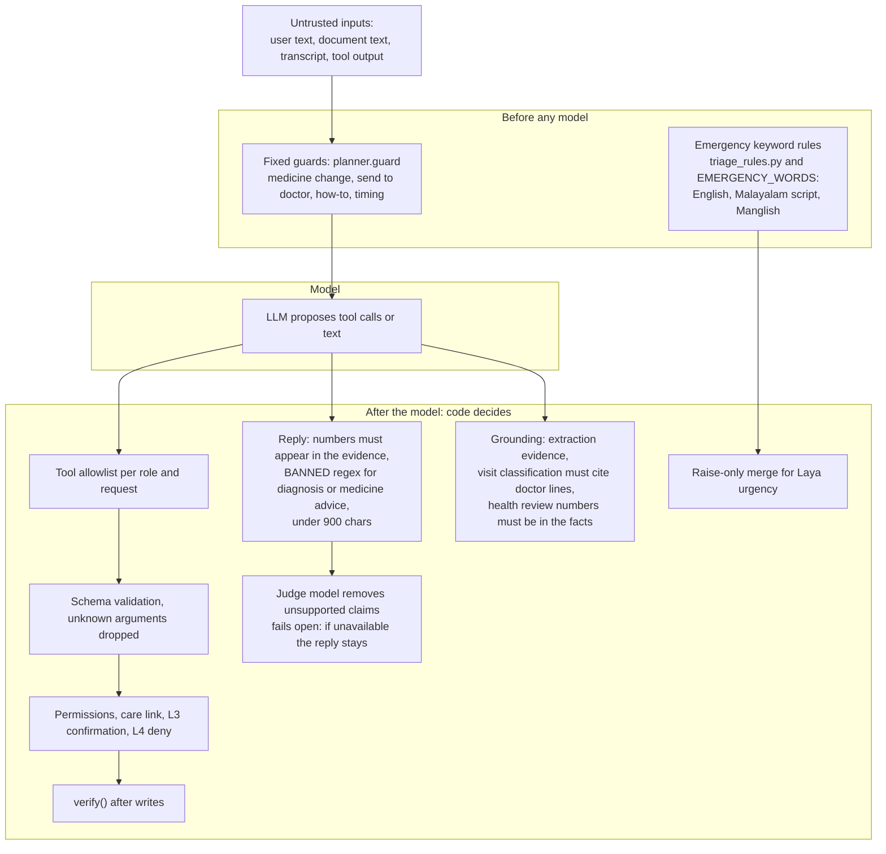

Prompt-injection defences (Implemented):

- Tool results are wrapped in `<tool_result>` tags, and the system prompt says to ignore instructions inside them (`loop.py`).
- Document text that looks like instructions to an AI raises a warning and is ignored (`extract.INJECTION`).
- Memory never stores raw document or record text (`engine._finish` comment, `memory.py`).
- The planner prompt tells the model to ignore rule changes (`planner._llm`).
- Most importantly, even a fully hijacked model can only call allowlisted tools for the caller's own record, and every write needs the human's Yes.

Grounding rules elsewhere (Implemented):

- `ai/visit_classify.py::validate`: every item needs valid line numbers. Diagnoses, medicines, tests, advice, referrals and follow-up must cite a **doctor** line and share real words with it. Dose, frequency, timing and duration are kept only if their cue appears in that medicine's own words.
- `ai/health_review.py`: a review point is dropped if any number in it is not in the facts or a small allowlist, or if it matches `BANNED`.
- `ai/doctor_ai.py::explain`: doctor ids outside the Python-ranked list are dropped.
- `ai/drug_usage.py::verify_items`: an openFDA side-effect quote must appear in the label text.
- `ai/medterms.py`: drug-name corrections in speech-to-text output are returned as `fixes` and shown in the console. They are never applied silently.

**Laya** (`ai/decision.py`, `ai/triage_rules.py`, `laya/app.py`):

- The service is used only if `LAYA_URL` is set, its `/info` reports the model loaded, and the quality gate in `eval_report.json` passed. `LAYA_ALLOW_UNGATED=1` overrides the gate for development.
- `merge_urgency` lets the model raise the urgency level only with confidence of 0.55 or more, and never lower it.
- The local breaker opens after 3 failures for 30 s. The time budget is 4 s for triage and 1.2 s for a console line. Answers are cached in Redis for 24 h. The `ai_decisions` audit table stores a hash of the input, never the text.
- **Current status (Documented, not re-measured; CLAUDE.md "Laya fine-tune result")**: the gate FAILED (urgency with rules 0.776 against the 0.80 needed), so production answers come from the rules alone.

---

## 16. Token Optimization

**Source of the numbers**: `docs/vault/Token optimisation.md`, `README.md`, `CLAUDE.md` (Documented, not re-measured).

- Baseline: one agent call was about 2,900 tokens (about 1,200 of instructions plus 34 tool definitions of about 2,600 characters), and one question took about 3 calls. That is about **8,800 tokens per question**.
- After: two simple questions took 2 calls and 5,112 tokens in total, about **2,500 per question**.

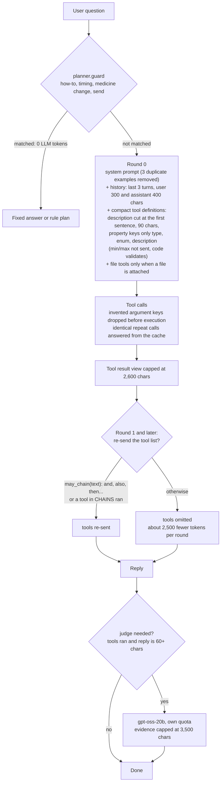

Each optimisation, the code that implements it, and its status:

| Optimisation | Code | Status |
| --- | --- | --- |
| Conditional tool injection after round 0 | `engine._agent_loop` (`offer = defs if rnd == 0 or wants_more or CHAINS...`), `loop.may_chain`, `loop.CHAINS` | Implemented |
| Compact tool schemas | `loop.tool_defs` | Implemented |
| File tools offered only with a file | `loop.pick_tools` (`FILE_TOOLS`) | Implemented. **Every other tool for the role is always offered.** Keyword-based subsetting was removed (comment in `pick_tools`). |
| History cap | `engine._agent_loop` (`history[-3:]`, 300/400 chars) | Implemented |
| Unknown arguments dropped (fewer failed retries) | `engine._agent_loop` (`args = {k: v ... if k in allowed}`) | Implemented |
| Duplicate tool calls answered from a cache | `engine._agent_loop` (`done` dict) | Implemented |
| Fixed answers before the model | `planner.guard`, `_help`, `_timing` | Implemented |
| Judge skipped for short replies or when no tool ran | `judge.MIN_REPLY`, `engine` | Implemented |
| Fail fast, no hidden SDK retries | `max_retries=0` in `llm.py`, `consultation.py`, `transcribe.py` | Implemented. `translator.py`, `health_review.py` and `doctor_ai.py` keep the default SDK retries. |
| Upload result reuse | `pipeline` `demo_cache/{sha256}.json` | Implemented (on disk, **not Redis**) |
| AI health review reuse | `hc:{pid}:{fingerprint}` in Redis, 120 s, plus an in-process `_CACHE` | Implemented |
| Laya answer cache | `laya:{model}:{digest}`, 24 h | Implemented (Laya is gated off) |
| Daily per-user budgets | `budget.py` (upload 30, doctor_ai 60, review 40), agent 80/day and 30/min | Implemented |
| Token meter | `app/tokens.py` (`tok:*` keys, `/admin`) | Implemented for agent-loop, agent-judge and json-calls. **Not recorded** for `translator`, `health_review`, `doctor_ai`, consultation `patient_summary`, Whisper or Gemini. |
| Prompt caching | n/a | Not verified in repository (`cached_tokens` is read from the usage object if present; nothing enables it) |
| Visit notes: incremental partial SOAP | n/a | **NOT IMPLEMENTED**: the partial SOAP is rebuilt from all lines every 3 lines (vault note "Not done") |

---

## 17. Scalability

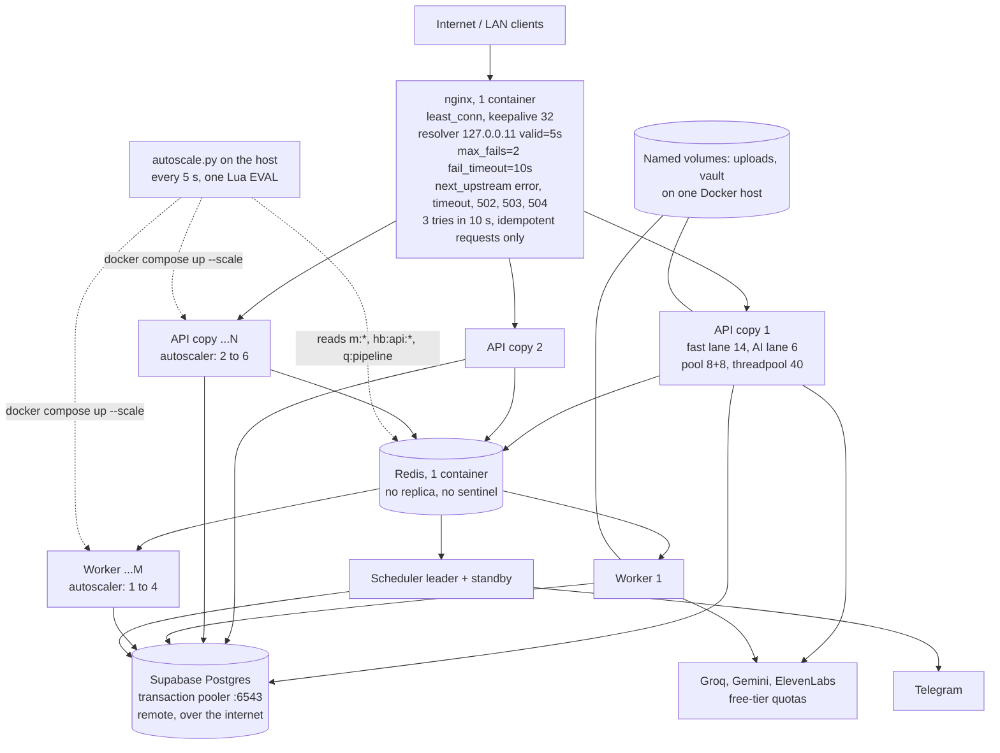

**Horizontal scaling** (Implemented unless labelled):

| Part | Scales out? | Why |
| --- | --- | --- |
| API copies | **Yes** | In queue mode they keep no state of their own. Sessions are JWTs; data is in Postgres. Rate limits, confirmations, agent memory, breakers, job state and progress are in Redis. Files are on shared named volumes. Exception: **agent background tasks run in a thread in the copy that received them.** |
| Upload workers | **Yes** | Atomic claim; one job per worker at a time |
| Schedulers | **No: active/standby** | The lease allows one sender. A second copy is for failover, not throughput. |
| nginx | **No** | One container, which is a single point of failure (Inferred) |
| Redis | **No** | One container; no replication, Sentinel or cluster configured (NOT IMPLEMENTED) |
| Postgres | **No** (external) | One Supabase project; no read replica (NOT IMPLEMENTED) |
| Named volumes | One host only | The `uploads` and `vault` volumes are local Docker volumes. Running on several hosts would need shared storage (Inferred; Planned / not implemented). |

**Concurrency limits** (Implemented; values from `docker-compose.yml` and `app/concurrency.py`):

- **Per API copy**: fast lane `MAX_INFLIGHT=14`, AI lane `MAX_AI_INFLIGHT=6`, at most 200 waiting, 15 s queue timeout, then 503 with `Retry-After: 2`.
  - The pool is 8 + 8 = 16 connections, so the lane caps keep in-flight requests under the pool size. This is the deadlock fix: `main.py` says "keeps in-flight requests below the connection pool".
  - scrypt runs at most 3 at a time per process (`SCRYPT_CONCURRENCY`).
  - Without Docker the defaults are 30 / 8 and a pool of 20 + 20.
- **Worker**: 1 job at a time; pool 3 + 2.
- **AI quotas (Documented)**: Groq's free tier allows 8,000 tokens per minute and 200,000 per day per model. Per-person daily budgets protect them (Section 16).
- **Edge**: `general` 30 requests/s per IP (burst 60), `auth` 10/min, `upload` 20/min, 40 connections per IP (`deploy/nginx/nginx.conf`).

**Autoscaling signals** (Implemented, `BackEnd/scripts/autoscale.py`):

- **API copies**: `ceil(rps / 25) + 1 if any request is waiting`, clamped to 2–6. The rps is averaged over the last 3 full 5-second buckets.
- **Workers**: `ceil(queue / 3) + 1 if queue > 0`, clamped to 1–4.
- **Behaviour**: scales up immediately; scales down one copy at a time after 60 s of lower demand. It runs `docker compose up -d --no-recreate --no-build --scale svc=N`.
- It is a host script, **not a container and not a cloud ASG**.

**Measured scaling (Documented, not re-measured)**: 100 users for 30 s through nginx `:8081`.

| | 1 API copy | 3 API copies | 3 copies, one killed halfway |
| --- | --- | --- | --- |
| Requests | about 1,775 (57/s) | about 3,090 (100/s) | 3,127 (101/s) |
| p50 | about 1,150 ms | about 345 ms | about 345 ms |
| p95 | about 1,390 ms | about 560 ms | about 530 ms |
| Errors | 0 | 0 | 0 |

**Confirmed bottleneck (Documented)**: "Throughput plateaus near 100 req/s past 3 copies: the remote Supabase database is the bottleneck" (`CLAUDE.md`, `README.md`). The mechanism is Inferred from implementation:

- Every request in the load mix does at least one database round trip over the internet to the transaction pooler.
- Adding API copies adds connections and threads but not database capacity or lower round-trip latency.

---

## 18. Reliability

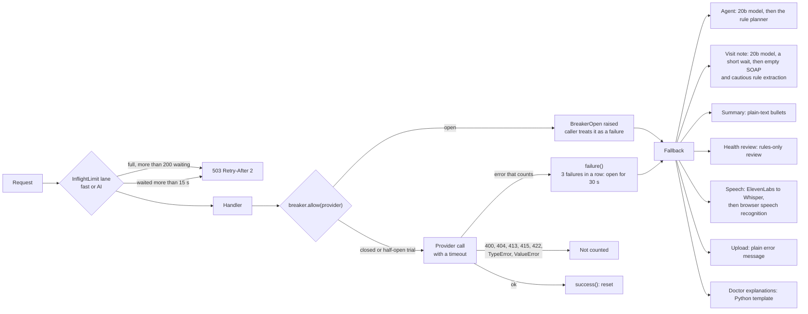

**Circuit breakers** (Implemented, `app/breaker.py`):

- Names: `groq:openai/gpt-oss-120b`, `groq:openai/gpt-oss-20b`, `groq:whisper`, `gemini` and `elevenlabs`.
- `THRESHOLD=3`, `COOLDOWN=30` s. The half-open state lets one trial call through with a 10 s probe window.
- State lives in Redis (`cb:*`) with a 1 s local read cache, so every API copy and worker sees the same breaker.
- Laya and TrOCR have their own **in-process** breakers: Laya opens after 3 failures for 30 s (`ai/decision.py`), TrOCR after 3 failures for 300 s (`ai/htr.py`).

**Timeouts and retries** (Implemented):

| Call | Timeout | Retries |
| --- | --- | --- |
| Groq, agent loop | 25 s | 0 SDK retries. 120b, then 20b on `RateLimitError` or `BreakerOpen`. |
| Groq, judge | 15 s | 0 |
| Groq, consultation and classification | 25 s | 0 SDK retries. `/finalize`: fallback model, then wait up to 8 s if `retry-after` is that short, then the main model once more. Live lines: no fallback and no wait. |
| Groq, translator, health review, doctor AI | 25 / 25 / 20 s | SDK default retries (2) |
| Groq Whisper | 30 s | 0 |
| ElevenLabs | 40 s | none; falls through to Whisper |
| Gemini | **no client timeout set** (`TIMEOUT_S` is defined but unused in `ai/extractor.py`) | up to 3 attempts per model on 503 or 429 with 1.5–3 s sleeps, across 4 models; one more full pass if the JSON is broken |
| Telegram | 4 s | none; a failed dose send is not recorded, so the next tick tries again within the 20-minute catch-up window |
| openFDA | 8 s | none; results cached in process for 7 days |
| Laya | 4 s triage, 1.2 s line | none |
| Upload clip in the browser | n/a | 3 tries with backoff of 600 ms × attempt |
| Typed console line in the browser | n/a | retried forever with backoff up to 4 s |

**Health checks** (Implemented):

- `/api/health/ready` checks the database, the store, the scheduler (ok when this process isn't meant to run one), DDInter presence and the Laya setting, and answers 503 if not ready. It is used by the backend Docker `HEALTHCHECK`.
- Workers: the healthcheck checks that `hb:worker:{HOSTNAME}` exists.
- Schedulers: the healthcheck checks that `/tmp/scheduler-alive` is younger than 60 s.
- nginx: `/nginx-health`. Redis: `redis-cli ping`.
- `/api/health/deep` (demo only) makes one tiny call each to the database, Redis, Gemini, Groq, Telegram `getMe`, and checks the scheduler.
- **nginx does not use these health endpoints for routing.** It relies on passive `max_fails` only.

---

## 19. Failure Modes

All entries are Inferred from implementation unless marked Implemented or Documented.

| # | Event | What happens |
| --- | --- | --- |
| 1 | **An API server dies** | nginx marks the copy failed after 2 errors and skips it for 10 s. Idempotent requests (GET, HEAD) that hit it are retried on another copy, up to 3 tries in 10 s. **POSTs in flight on the dead copy fail** (nginx never retries non-idempotent requests by default). Agent background tasks and in-API upload threads in that process are lost. Uploads already on the Redis queue are unaffected. The heartbeat `hb:api:*` expires in 10 s, so the `/admin` live panel shows one copy fewer. **Documented result**: 0 errors in a GET-heavy load test with one copy killed. |
| 2 | **A worker dies** | Its heartbeat expires in 20 s. Another worker's janitor runs every 15 s and moves the dead worker's processing list back to `q:pipeline` with `attempts + 1`. After 2 attempts, an error event is sent. **If every worker is dead, no janitor runs**: jobs already queued wait, and new uploads run in an API thread (`start_job` sees no heartbeat). |
| 3 | **The scheduler leader dies** | The lease (`lease:reminders`, 90 s) stops being renewed. The standby tries every 30 s tick, so it takes over within about 90–120 s. Doses due during the gap are still sent if they fall inside the 20-minute `CATCH_UP` window; older doses are not sent. `SentDose` rows let the new leader skip doses already sent (Implemented, `_already_sent`). |
| 4 | **Redis is unavailable** | `store.*` calls fall back to **per-process memory**. Rate limits, budgets, lockouts, pending confirmations, agent memory, breakers, `taken` marks and leases become local to each process. Consequences: a confirmation parked on one copy shows as "expired" on another; the reminders list loses taken marks. **Both schedulers can believe they lead** (each wins its own in-memory lease), and since a dose is recorded *after* it is sent, a dose can be sent twice in that window. `jobqueue` uses the raw client, so **uploads fail with 500** and SSE streams fail. Workers crash on `BLMOVE` and Docker restarts them. `/api/health/ready` gives 503. Metrics silently stop. |
| 5 | **The database is unavailable** | At runtime there is no fallback: requests fail after `connect_timeout=8` / `pool_timeout=15` and the handler errors (500). Readiness gives 503. Scheduler ticks are caught and logged. Worker `process_job` reports a generic error event. **At startup** a copy falls back to SQLite. In Docker the root filesystem is read-only, so creating `/app/medithread.db` should fail and the container restarts. Outside Docker, a copy could silently start on SQLite while the others use Postgres. |
| 6 | **An AI provider times out** | The timeout counts as a breaker failure. Agent: if no tool has run yet, the rule planner answers; otherwise the loop stops and returns the data cards. Live visit lines: the partial SOAP refresh returns an **empty** note, which overwrites the previous partial note until the next successful refresh. Finalize: empty SOAP, classification `None`, then approve uses the cautious rule extraction. Upload: `ExtractError` "busy" or "took too long". |
| 7 | **An AI provider returns errors** | 429: the fallback model (Groq) or the next model in the list (Gemini). Auth errors: plain messages, and the breaker counts them. Client-side errors (400, 404, 413, 415, 422) do not open the breaker. Laya: any failure gives `None`, so the rules answer. |
| 8 | **A queue consumer dies mid-job** | Same as #2. **At-least-once**: if rows were committed before the crash, the retry can create a duplicate document (Documented in the README). |
| 9 | **The browser disconnects during an upload** | Before the POST completes: no job. After the job id is issued: in queue mode the worker finishes and saves; the UI shows "Lost connection" and does not reconnect, but the record appears on the Timeline. In in-process mode: the thread finishes; a new listener gets a replay only after the job is done. |
| 10 | **Two workers try the same job** | Prevented for queued jobs by the atomic `BLMOVE` (Implemented). Possible after a requeue if the first worker was still running but its heartbeat key expired (for example a 20 s stall of the heartbeat thread); both would then process the job (Inferred). |

---

## 20. Load Testing

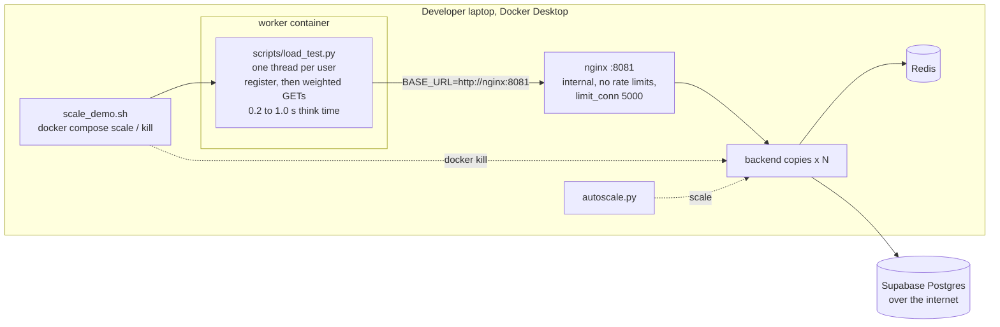

**Workload** (Implemented, `BackEnd/scripts/load_test.py`):

- Each user registers once (POST, scrypt).
- Then it loops on weighted GETs: timeline ×4, medicines ×3, profile ×3, alerts ×2, insights ×2, health-check `?ai=false` ×1.
- **No AI routes are called**, so the numbers measure the database, auth and app path, not model latency.
- The test prints requests/s, p50, p95, p99 and errors per route.

**Original starvation / deadlock (Documented, `docs/vault/Scalability.md`, `CLAUDE.md`)**:

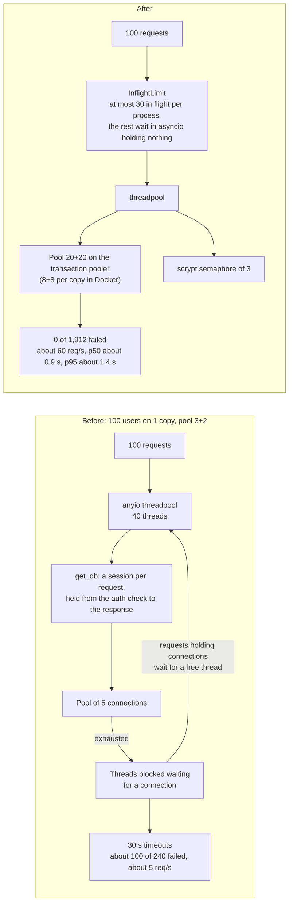

| | Before | After |
| --- | --- | --- |
| Errors | about 100 of 240 requests | 0 of 1,912 |
| Throughput | about 5 req/s | about 60 req/s |
| Latency | 30 s timeouts | p50 about 0.9 s, p95 about 1.4 s |

The fixes (Implemented): `app/concurrency.py` (`InflightLimit`), `app/database.py` (pool sizes), `app/auth.py` (`SCRYPT_CONCURRENCY`), `app/database.py::add_missing_indexes`, the review cache in `routers/patients.py`, `app/budget.py`, and the slow-request warning in `app/observability.py`.

Scale-out and autoscale results are in Section 17. Autoscaler (Documented): 150 users, 2 → 6 copies in about 15 s, 0 errors in 4,644 requests, then scaled back down.

---

## 21. Chaos Testing

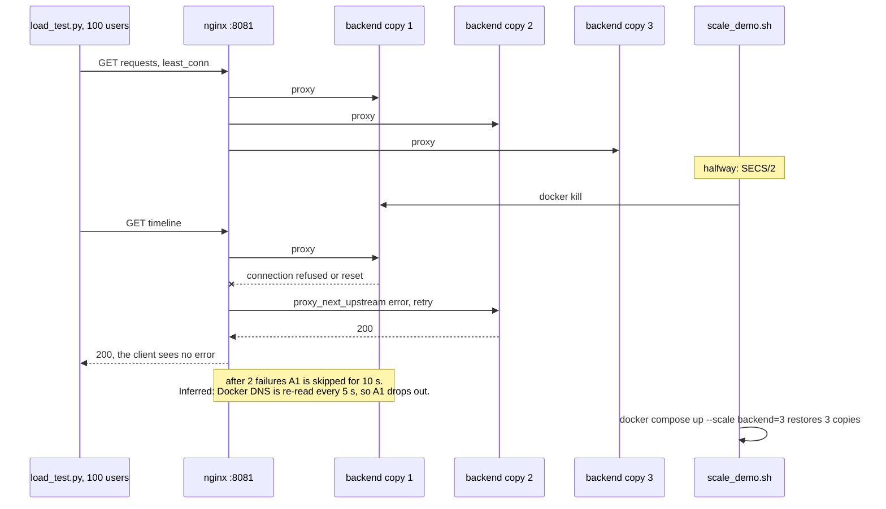

- **Implemented**: `BackEnd/scripts/scale_demo.sh` step 3 runs `docker kill` on the first `backend` container halfway through the test.
- **Documented result**: 3,127 requests, 101 req/s, p50 about 345 ms, **0 errors** (README, `docs/vault/Scalability.md`).
- **Why zero is plausible (Inferred)**: users register within the first ~2 s, before the kill at half time. After that the workload is GET-only, and nginx retries idempotent requests on a healthy copy.
- **Not tested**: POST or write traffic during the kill, which nginx would not retry; killing Redis, the database, nginx or a worker mid-test.

---

## 22. Observability

Implemented:

- **Request logs**: `app/observability.py` writes one JSON line per request to stdout: request id (from `X-Request-Id` or new), method, redacted path, status, ms, slow flag (1,000 ms or more is logged as a warning), client IP. It adds the `X-Request-Id` and `X-Served-By` response headers. Health paths are quiet.
- **nginx logs**: a JSON access log with share tokens and job ids redacted and no query strings. nginx generates `$request_id` and passes it upstream.
- **Metrics** (`app/metrics.py`): in-process counters are flushed every 2 s into Redis hashes `m:{5 s bucket}` (15 min retention), holding request count, total ms, a latency histogram (50 … 5,000 ms buckets), 5xx, 429 and shed count. `live()` combines the last ~minute plus heartbeats of API copies, workers and schedulers, the queue depth, the scheduler leader and the breaker states.
- **Admin UI** (`Frontend/src/pages/Admin.jsx`): `/api/admin/live` polled every 2 s, and `/api/admin/metrics` with agent tool calls by tool and status, confirmations, tasks, rules-vs-model answers, voice clips by engine, stored files, recent problems, configured services and today's tokens.
- **Audit trails**: `agent_audit` (every tool call), `access_logs` (every view or change shown to the patient), `ai_decisions` (Laya, input hash only).

**NOT IMPLEMENTED**: distributed tracing (no tracer is configured in the code), log shipping or aggregation, alerting, Prometheus or OpenTelemetry exporters, and dashboards beyond `/admin`.

---

## 23. Deployment Architecture

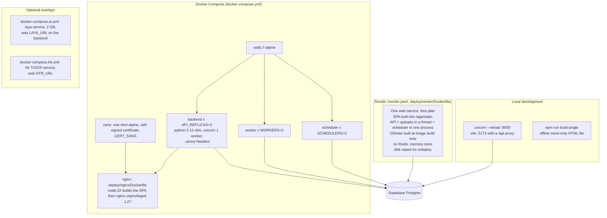

Volumes (Implemented):

- `./BackEnd/demo_cache` (bind mount, upload result cache)
- `./BackEnd/data/ddi` (read-only, DDInter SQLite)
- `uploads`, `vault`, `redis-data` and `certs` (named volumes)

Container limits: backend 512 MB, worker 512 MB, scheduler 256 MB, Redis 192 MB, nginx 128 MB.

Environment variables read by the code (Implemented, found by searching for `os.getenv`):

| Group | Variables |
| --- | --- |
| Core | `DATABASE_URL`, `REDIS_URL`, `JWT_SECRET`, `CORS_ORIGINS`, `DEMO_MODE`, `RESET_DB` |
| AI keys | `GEMINI_API_KEY`, `GROQ_API_KEY`, `ELEVENLABS_API_KEY`, `ELEVENLABS_STT_MODEL`, `GROQ_STT_MODEL` |
| Messaging | `TELEGRAM_BOT_TOKEN`, `TELEGRAM_CHAT_ID` |
| Files | `FILE_ENC_KEY`, `FILE_ENC_KEY_PREV`, `VAULT_DIR`, `STATIC_DIR` |
| Process roles | `SCHEDULER`, `QUEUE_MODE`, `HOSTNAME` |
| Database pool | `DB_POOL_MODE`, `DB_POOL_SIZE`, `DB_MAX_OVERFLOW` |
| Limits | `MAX_INFLIGHT`, `MAX_AI_INFLIGHT`, `MAX_WAITING`, `QUEUE_TIMEOUT`, `SCRYPT_CONCURRENCY`, `SLOW_REQUEST_MS`, `BREAKER_THRESHOLD`, `BREAKER_COOLDOWN` |
| Budgets | `AGENT_DAILY_LIMIT`, `UPLOAD_DAILY_LIMIT`, `DOCTOR_AI_DAILY_LIMIT`, `REVIEW_DAILY_LIMIT` |
| Optional services | `LAYA_URL`, `LAYA_API_KEY`, `LAYA_TIMEOUT_MS`, `LAYA_LINE_TIMEOUT_MS`, `LAYA_ALLOW_UNGATED`, `HTR_URL`, `HTR_TIMEOUT_S`, `OPENFDA_ENABLE`, `AGENT_JUDGE` |
| Admin | `ADMIN_EMAILS` |
| Frontend | `VITE_API_URL`, `VITE_USE_MOCK`, `VITE_SINGLE` (build mode), `VITE_PROXY_TARGET` (dev server) |

**CI/CD**: none found (no `.github/workflows`). NOT IMPLEMENTED.

---

## 24. External Integrations

| Integration | Used for | Code | Timeout and breaker | Fallback |
| --- | --- | --- | --- | --- |
| Gemini (`gemini-flash-latest` → `gemini-3.5-flash` → `3.7` → `3.8`) | Document reading, handwriting second pass | `ai/extractor.py`, `ai/handwriting.py` | no client timeout; breaker `gemini` | A cached result for the same file; otherwise a plain error |
| Groq `openai/gpt-oss-120b` | Agent loop, planner JSON, summaries + Malayalam, health review, visit notes, classification, doctor explanations | `app/agent/llm.py`, `ai/*.py` | 15–25 s; per-model breaker | `gpt-oss-20b` (agent, finalize), then rules or templates |
| Groq `openai/gpt-oss-20b` | Fallback model and reply judge | `llm.py`, `consultation.py` | 15–25 s | Judge fails open |
| Groq `whisper-large-v3` | Speech to text | `ai/transcribe.py` | 30 s; breaker `groq:whisper` | Browser speech recognition (console) |
| ElevenLabs Scribe `scribe_v1` | Speech to text when its key is set | `app/speech.py` | 40 s; breaker `elevenlabs` | Whisper |
| Telegram Bot API | Dose, nudge, missed-dose, refill, follow-up, emergency and upload notices | `ai/telegram.py` | 4 s | Not recorded as sent, so retried on the next tick |
| openFDA label API | Usual timing, side effects (quotes checked) | `ai/drug_usage.py` | 8 s | "Not found" message |
| openFDA event API | Interaction fallback | `ai/safety.py` | 3 s | Off by default (`OPENFDA_ENABLE`) |
| DDInter (local SQLite, CC BY-NC-SA 4.0) | Interactions, known-drug check | `ai/ddi.py`, `scripts/build_ddi.py` | local | Curated `PAIRS` only |
| FHIR R4 Bundles | Hospital import | `app/fhir_import.py` | 2 MB cap | Unsupported resources are skipped and reported |
| LOINC | Lab code mapping | `app/labs.py` | n/a | Name matching or a slug |
| Laya (HF `convaiinnovations/laya`) | Triage and line flags | `ai/decision.py`, `laya/app.py` | 4 s / 1.2 s, local breaker | Rules only (current state: gated off) |
| TrOCR (`microsoft/trocr-base-handwritten`) | Third handwriting reader | `ai/htr.py`, `htr/app.py` | 25 s, local breaker | Skipped |
| OpenStreetMap tiles | Doctor map | `Frontend/src/pages/Doctors.jsx` | browser | Grey map, list still works |
| Supabase Postgres | Main database | `app/database.py` | connect 8 s | SQLite at startup only |

---

## 25. Data Flow Diagrams

### 25.1 Where medical data enters, lives and leaves

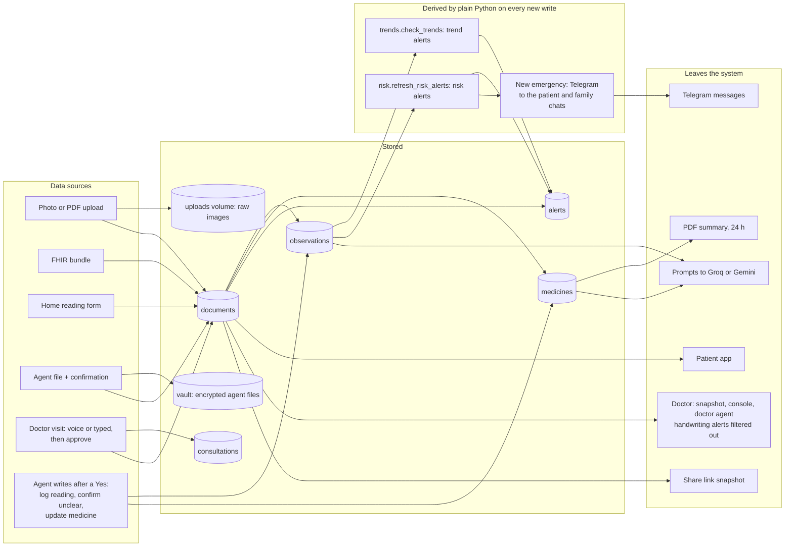

Notes on what reaches a model (Implemented):

- Gemini receives the raw document bytes.
- Groq receives document facts (for the summary), the whole record's series, medicines and warnings (health review), visit transcripts (SOAP and classification), the patient's chat text and short tool views (agent), and tool results (judge).
- `ai/doctor_ai.py` sends only the doctor-directory fields plus the stated need, language and age.

### 25.2 Flow summary table

| Flow | Actor | Service path | Database | Redis | Queue | External | Failure path |
| --- | --- | --- | --- | --- | --- | --- | --- |
| 1 Upload a prescription | Patient | documents → pipeline → worker | Document, Observation, Medicine, Alert, AccessLog | job:*, jobev:*, q:*, hc:* delete, budget | q:pipeline | Gemini, Groq, Telegram | ExtractError event; requeue on worker death |
| 2 Ask the AI a question | Patient | agent router → engine → loop | agent_tasks, agent_audit | agent:rate/day/hist | none (thread for slow steps) | Groq | Rule planner |
| 3 Read-only tool | Agent | executor → handler | Reads, plus an audit row | none | none | none or openFDA | Error block |
| 4 Write request | Agent | executor `_park` | audit needs_confirmation | agent:confirm:* | none | none | Preview error, then failed |
| 5 Human approves | Patient | `/confirm` → executor.run(confirmed) | Write + audit ok | agent:confirm delete | none | maybe Telegram | Verify fails, so not reported as done |
| 6 Doctor access | Doctor | doctor router | care_links, access_logs, share_links | badcode | none | none | 404 without a link |
| 7 Reminder | Scheduler | reminder_service | sent_doses, sent_notices | lease, dose:*, taken:* | none | Telegram | Send failure: retried next tick |
| 8 Voice to note | Doctor | consultations | consultations, then Document, Medicine, Alert on approve | breakers | none | ElevenLabs/Whisper, Groq | Browser speech recognition; fallback extraction |
| 9 AI provider fails | n/a | breaker | none | cb:* | none | provider | Fallbacks (Section 18) |
| 10 Worker crash | n/a | janitor | possible duplicate | hb:worker, q:processing | requeue | none | Error after 2 attempts |
| 11 API crash | n/a | nginx | none | hb:api | none | none | GET retried; POST fails |
| 12 Autoscale | Operator script | autoscale.py | none | m:*, hb:api, q:pipeline | depth read | Docker CLI | Prints "can't read Redis" |

---

## 26. Sequence Diagrams

### 26.1 Flow 1: patient uploads a prescription (queue mode)

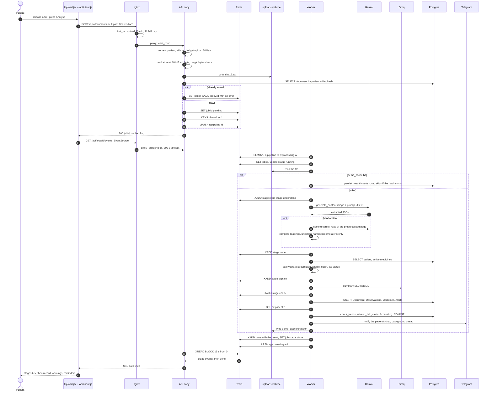

### 26.2 Flows 2 and 3: patient asks a question, read-only tool call

```mermaid
sequenceDiagram
  autonumber
  actor P as Patient
  participant UI as AgentPanel
  participant API as /api/agent/chat
  participant R as Redis
  participant E as AgentEngine
  participant L as Groq gpt-oss-120b
  participant X as AgentExecutor
  participant DB as Postgres
  participant J as Groq gpt-oss-20b judge
  P->>UI: "how is my sugar lately"
  UI->>API: POST text, conversationId
  API->>R: agent:rate and agent:day counters
  API->>E: chat with ctx built from the JWT
  E->>R: GET agent:hist, agent:sess
  E->>E: planner.guard: no match
  E->>DB: INSERT agent_tasks intent agent
  E->>L: system prompt, 3 turns of history, user text, 34 compact tool definitions (patient role, no file attached)
  L-->>E: tool_call health__trend code=hba1c
  E->>E: map the function name to a registered tool, drop unknown args
  E->>X: run health.trend
  X->>X: schema check, permissions, level L1
  X->>DB: SELECT observations for ctx.patient_id
  X->>DB: INSERT agent_audit ok
  X-->>E: metric and comparison blocks + evidence
  E->>L: tool result view inside tool_result tags, no tools re-sent
  L-->>E: reply text
  E->>E: reply_ok: numbers in the evidence, no BANNED wording
  E->>J: tool results + reply
  J-->>E: claims, supported true
  E->>R: SET agent:hist with the user text and the checked reply
  E->>DB: UPDATE agent_tasks completed
  E-->>API: blocks, evidence, disclaimer
  API-->>UI: JSON
  alt LLM unavailable before any tool
    E->>E: delete the task, planner.plan rules: health.trend
    E->>X: same executor path
  end
```

### 26.3 Flows 4 and 5: write request and human approval

```mermaid
sequenceDiagram
  autonumber
  actor P as Patient
  participant UI as AgentPanel
  participant E as AgentEngine
  participant X as AgentExecutor
  participant R as Redis
  participant DB as Postgres
  P->>UI: "log my bp 150 over 95"
  UI->>E: POST /api/agent/chat
  E->>X: run health.log_reading sbp=150 dbp=95
  X->>X: schema check: number ranges
  X->>X: permission records:write, level L3, not confirmed
  X->>X: preview: BP top 150, bottom 95, today, check these numbers
  X->>R: SET agent:confirm:cid with actor, role, patient, tool, args, sha256, 600 s
  X->>DB: INSERT agent_audit needs_confirmation
  X-->>E: needs_confirmation + confirmation card
  E->>DB: task waiting_for_confirmation
  E-->>UI: fixed reply: I need your OK + card
  P->>UI: Yes, do it
  UI->>E: POST /api/agent/confirm id=cid approve=true
  E->>X: confirm(ctx, cid, true)
  X->>R: GET agent:confirm:cid
  X->>X: same actor, role and patient
  X->>R: DEL agent:confirm:cid, single use
  X->>X: args hash unchanged
  X->>DB: add_vitals: INSERT Document vitals + Observations
  X->>DB: after_new_data: trends, risks, maybe a Telegram emergency
  X->>DB: verify: the Document exists for this patient
  X->>DB: INSERT agent_audit ok confirmed=true
  X-->>E: timeline_event + risk warnings
  E->>DB: task completed, the remaining steps run
  E-->>UI: result
  alt person says No
    X->>DB: agent_audit declined
    E->>DB: task cancelled
  end
```

### 26.4 Flow 6: doctor accesses a patient record

```mermaid
sequenceDiagram
  autonumber
  actor Pt as Patient
  actor D as Doctor
  participant API as API
  participant R as Redis
  participant DB as Postgres
  Pt->>API: POST /api/care/invite, patient JWT
  API->>DB: DELETE unused codes, INSERT invite_codes, 24 h
  API-->>Pt: code like ABCD-2345
  Pt-->>D: tells the doctor the code
  D->>API: POST /api/doctor/link code, doctor JWT
  API->>R: GET badcode:doctor, under 10?
  API->>DB: SELECT the invite code, unused and unexpired?
  alt invalid
    API->>R: SET badcode:doctor +1, 15 min
    API-->>D: 400
  else valid
    API->>DB: mark used, UPSERT care_links active, AccessLog
    API-->>D: patientId, name
  end
  D->>API: GET /api/doctor/patients/pid/snapshot
  API->>DB: SELECT an ACTIVE care link, else 404
  API->>DB: AccessLog: viewed full history
  API-->>D: timeline, medicines, alerts without handwriting, insights, risks
  D->>API: POST /api/doctor/patients/pid/console-token
  API->>DB: INSERT share_links, 8 h, doctor_user_id
  API-->>D: token, so the UI opens /console/token
  Pt->>API: DELETE /api/care/doctors/link_id
  API->>DB: care_links revoked, DELETE that doctor's share_links, AccessLog
  D->>API: POST /api/consultations/cid/line with X-Share-Token
  API->>DB: the share link is gone
  API-->>D: 404
```

### 26.5 Flow 7: medicine reminder scheduled and delivered

```mermaid
sequenceDiagram
  autonumber
  participant S1 as Scheduler A
  participant S2 as Scheduler B
  participant R as Redis
  participant DB as Postgres
  participant T as Telegram
  actor P as Patient
  loop every 30 s, APScheduler, IST
    S1->>R: EVAL lease Lua: renew if owner, else SET NX EX 90
    R-->>S1: 1, leader
    S2->>R: EVAL lease Lua
    R-->>S2: 0, standby
    S1->>R: SET hb:scheduler:A leader
    S1->>DB: SELECT reminder_settings enabled
    S1->>DB: SELECT active medicines in course
    S1->>R: GET dose:med@08:00@date
    S1->>DB: SELECT sent_doses for med, clock, date
    alt due within 0 to 20 min and not sent
      S1->>T: sendMessage dose text
      alt ok
        S1->>DB: INSERT sent_doses, COMMIT
        S1->>R: SET dose:key, 2 days
      else failed
        S1->>S1: not recorded, retried next tick
      end
    end
    S1->>DB: nudge: SELECT sent_doses today, not taken, under 5 nudges, 60 min since last, before 22:00
    S1->>DB: claim: nudges+1, COMMIT
    S1->>T: one message listing the doses
    S1->>DB: missed: sent over missed_after_minutes ago and not taken
    S1->>T: family chat message, then missed_notified=true
    S1->>DB: refill or follow-up tomorrow: INSERT sent_notices key, COMMIT
    S1->>T: notice, the key is deleted again if the send fails
  end
  T-->>P: Time for Glycomet 500 ...
  P->>DB: POST reminders/key/taken: SET taken:pid:date:key, sent_doses.taken=true
```

### 26.6 Flow 8: voice consultation becomes a clinical note

```mermaid
sequenceDiagram
  autonumber
  actor D as Doctor
  participant RP as RecordingPanel + useWhisperRecorder
  participant API as /api/consultations
  participant SP as speech.py
  participant EL as ElevenLabs
  participant WH as Groq Whisper
  participant Q as Groq gpt-oss
  participant LY as Laya, optional
  participant DB as Postgres
  D->>API: POST /start patientToken = share token
  API->>DB: validate the share link, INSERT consultation active, AccessLog
  loop each sentence, cut after 900 ms of silence
    RP->>API: POST /cid/audio clip, speaker, language, X-Share-Token
    API->>DB: consultation + share link still valid
    API->>API: 6 MB cap, magic bytes, under 800 bytes means nothing
    API->>SP: transcribe
    alt ElevenLabs key set
      SP->>EL: speech-to-text
      EL-->>SP: text or error
    end
    SP->>WH: whisper-large-v3 verbose_json, if needed
    WH-->>SP: segments, phantom and low-confidence ones dropped
    API->>API: 90% or more similar to one of the last 2 lines: not added
    API->>API: medterms.correct: fixes listed, never silent
    API->>API: fast checks: emergency regex, duplicate, allergy, interaction
    API->>LY: line_flags, only if usable, raise-only
    API->>API: missing-info flags at 6 or more lines
    opt every 3rd line
      API->>Q: partial SOAP and suggested questions, no fallback, no wait
    end
    API->>DB: UPDATE consultation lines, flags, soap, questions
    API-->>RP: transcript, flags, partial note, suggestions
  end
  D->>RP: Stop and review, waits for queued clips
  RP->>API: POST /cid/finalize
  par
    API->>Q: final SOAP with source_lines, fallback 20b, short wait
  and
    API->>Q: visit classification JSON
  end
  API->>API: visit_classify.validate grounding
  API->>DB: final_note, status draft
  D->>API: POST /cid/approve edits, removedItems indexes
  API->>Q: patient summary EN + ML
  API->>DB: INSERT Document visit, flush, Observations from spoken vitals
  API->>DB: stop or replace medicines, INSERT new medicines with times
  API->>DB: open flags become Alerts, after_new_data, AccessLog, COMMIT
  API-->>D: record, alerts, reminders, classification, stopped medicines
```

### 26.7 Flow 9: AI provider fails during an agent question

```mermaid
sequenceDiagram
  autonumber
  participant E as AgentEngine
  participant B as breaker, Redis cb:*
  participant L1 as Groq 120b
  participant L2 as Groq 20b
  participant PL as Rule planner
  participant X as Executor
  E->>B: allow groq 120b?
  alt breaker open
    B-->>E: BreakerOpen
  else closed
    E->>L1: chat with tools, 25 s
    L1-->>E: RateLimitError or timeout
    E->>B: failure count+1, open after 3
  end
  E->>B: allow groq 20b?
  E->>L2: chat with tools
  alt 20b also fails
    L2-->>E: error
    E->>E: _agent_loop returns None, no tool ran
    E->>PL: planner.plan rules
    PL-->>E: plan, or ask the person to rephrase
    E->>X: run the planned steps
  else 20b answers
    L2-->>E: tool calls or text
  end
```

### 26.8 Flow 10: worker crashes during processing

```mermaid
sequenceDiagram
  autonumber
  participant W1 as Worker 1
  participant W2 as Worker 2
  participant R as Redis
  participant DB as Postgres
  W1->>R: BLMOVE q:pipeline to q:processing:w1, job J
  W1->>DB: maybe partial or complete inserts
  Note over W1: process killed
  R->>R: hb:worker:w1 expires after 20 s
  loop janitor every 15 s
    W2->>R: KEYS q:processing:*
    W2->>R: EXISTS hb:worker:w1, false
    W2->>R: RPOP q:processing:w1, gets J
    W2->>R: job J attempts+1
    alt attempts 2 or fewer
      W2->>R: LPUSH q:pipeline J
    else more than 2
      W2->>R: XADD jobev:J error
    end
  end
  W2->>R: BLMOVE claims J
  W2->>DB: runs the pipeline again, can duplicate rows if W1 had committed
  W2->>R: XADD done, the browser stream replays from 0
```

### 26.9 Flow 12: autoscaler adds and removes API replicas

```mermaid
sequenceDiagram
  autonumber
  participant AS as autoscale.py on the host
  participant R as Redis
  participant DC as docker compose
  participant N as nginx
  loop every 5 s
    AS->>R: EVAL Lua: sum m:* req for the last 15 s, hb:api:* waiting, LLEN q:pipeline, hb:worker:*
    R-->>AS: rps, copies, waiting, queue, workers
    AS->>DC: ps backend, ps worker, running count
    alt want more than running
      AS->>DC: up -d --no-recreate --no-build --scale backend=want
      DC-->>N: new containers
      N->>N: resolver re-reads backend DNS within 5 s
    else want fewer for 60 s
      AS->>DC: scale backend=running-1
    end
  end
```

Flow 11 (an API server crashes under load) is drawn in Section 21.

---

## 27. Architecture Decisions

Each decision is labelled **Confirmed** (the reason is written in code comments or docs) or **Interpretation** (a reasonable reading of the implementation).

| Decision | What was chosen | Why |
| --- | --- | --- |
| Why Redis | One Redis for queue, streams, leases, limits, caches and metrics | Confirmed: `jobqueue.py`, `metrics.py` and `breaker.py` docstrings ("so all API copies and workers see the same breaker"; "any API copy can stream them"). Optional, with a memory fallback, so a single process runs without it (`store.py`, spec). |
| Why PostgreSQL (Supabase) | Managed Postgres plus a SQLite fallback | Confirmed in SPEC.md ("Supabase Postgres ... if Supabase connection fails, fall back to local SQLite"). The transaction pooler was chosen after `EMAXCONNSESSION` errors (`database.py`, CLAUDE.md). |
| Why a queue | Uploads go through a Redis list | Confirmed: so any copy can accept an upload, workers can scale, and a dead worker's job is put back (`jobqueue.py` docstring). |
| Why Redis Streams | Progress events in `jobev:{id}` | Confirmed: "replay it from the start, so any API copy can serve it" (`routers/documents.py`). |
| Why stateless API copies | JWT plus shared Redis and Postgres | Confirmed (`docker-compose.yml` comments). |
| Why nginx | LB, TLS, CSP, rate limits, static files | Confirmed (`nginx.conf` comments). |
| Why tool-based AI | 46 registered tools, one executor | Confirmed: "The LLM never touches the DB. It names a registered tool with arguments and this decides if it runs" (`executor.py`). |
| Why human approval | L3 parks until `/confirm` | Confirmed (`writes.py` docstring: "so 'done' is only said when it's true"). |
| Why circuit breakers | Shared, per provider | Confirmed: "instead of every request waiting 25 s for the same failure" (`breaker.py`). |
| Why bulkheads | Fast and AI lanes | Confirmed: "50 people chatting with the Agent can't slow down someone opening their medicines" (`concurrency.py`). |
| Why provenance | Value plus page, line and quote | Confirmed: "Empty beats made up" (`agent/extract.py`). |
| Why FHIR | Import hospital exports | Interpretation: a standard format for records the patient already receives; dedupe by `external_id` (`fhir_import.py`). |
| Why separate workers | Gemini calls take seconds | Interpretation, plus the `worker_main.py` docstring. |
| Why caching | File-hash replay, review cache | Confirmed: "Gemini's free tier hits 429 quickly, so keep these cache files" (CLAUDE.md); review reuse "uses the quota" (`routers/patients.py`). |
| Why conditional tool loading | Tools omitted after round 0 | Confirmed: "The tool list is about 2,500 tokens and gets re-sent every round" (`engine.py` comment). |
| Why a raise-only Laya | Rules first | Confirmed (`triage_rules.py`, `ml/README.md`). |
| Why a single uvicorn worker per container | The scheduler was in-process originally | Confirmed for Render (`deploy/render/Dockerfile`). In Compose, `SCHEDULER=off`, so the comment in `BackEnd/Dockerfile` is out of date. |

---

## 28. Current Limitations

### 28.1 IMPLEMENTED today, with its limits

| Area | Limitation | Evidence |
| --- | --- | --- |
| Single points of failure | One nginx, one Redis, one Postgres project, one Docker host | `docker-compose.yml` |
| Redis outage | Uploads fail (no memory fallback in `jobqueue`). Scheduler leases become per process, so a dose can be sent twice. | `jobqueue.py`, `store.hold_lease`, `reminder_service.run_tick` |
| Dose dedup | Recorded **after** the Telegram send, with no unique constraint. The code comment "Sent doses are also claimed in the DB before sending" does not match the code (doses are recorded after the send; only nudges and notices are claimed first). | `reminder_service.py` lines around `_record_sent` and `_job` |
| Job idempotency | At-least-once; a retried job can save twice | README "Known limits", `pipeline._run_sync` |
| Agent tasks | Background threads die with their API copy | README "Known limits", `tasks.run_in_thread` |
| Upload cache | Keyed by file hash only. A cached result built for one patient (including interaction alerts against that patient's medicines) is replayed into another patient's record if they upload the identical file. | `pipeline._persist_result` (Inferred) |
| Share scope | `labs` and `medicines` scopes filter only the timeline. The snapshot still returns medicines and alerts. | `routers/shares.py` |
| Share token power | A patient QR or share link can start and approve a visit note | `routers/consultations.py::start/_authorize` |
| Upload storage | Raw images are unencrypted on the `uploads` volume | `pipeline._save_upload` |
| Auth | No server-side logout or revocation; 7-day JWT; a default secret if unset; no email verification or password reset | `app/auth.py`, README |
| Counters | Not atomic (`get` + `set`) | `budget.py`, `routers/agent.py`, `routers/auth.py` |
| Gemini | No client timeout | `ai/extractor.py` |
| Live visit note | A failed partial SOAP refresh blanks the previous partial note | `consultation.partial_soap`, `_append_line` |
| Whisper vocabulary | The patient's medicine list is built (`vocab`) but **not passed** to Whisper; only the common-brand list primes it. CLAUDE.md says the prompt includes the patient's medicines. | `routers/consultations.py::add_audio`, `app/speech.py` |
| Medicine boundary | "No tool can change a medicine" (README, LinkedIn drafts) is too strong: `medications.update` (L3) edits the dose, schedule or duration of an existing medicine after confirmation. No tool starts, stops or switches a drug. | `tools/writes.py` |
| Agent tool subset | The README says the loop "picks tools from a small relevant subset". The code offers every tool for the role (file tools only with a file). | `loop.pick_tools` |
| Reminder parsing | `"thrice daily"` and `"four times daily"` give one 08:00 time (operator precedence in `parse_schedule`). Verified by running the function. | `ai/reminders.py` |
| Console Stop | **Stop and review** waits for voice clips but not for the typed / browser-speech line queue. Pending retries are not cancelled when the panel closes. | `RecordingPanel.jsx::handleStop`, `pump` |
| In-process SSE | The upload job starts only when the first SSE listener connects; a second listener during the run receives nothing | `pipeline.run_async` |
| Admin UI route | `/admin` is inside the patient `Layout`, so an admin with a doctor account is redirected away (the API itself accepts any login) | `Frontend/src/App.jsx` |
| Render free tier | Sleeps (reminders pause), no Redis, disk wiped on redeploy, one process | `render.yaml`, README |
| Laya | Gated off: urgency 0.776 against the required 0.80; Malayalam and Manglish weak | CLAUDE.md |
| Datasets | DDInter is non-commercial (CC BY-NC-SA); the doctor directory is fictional | README, `ml/DATA_LICENSES.md` |
| Compliance | No consent records beyond care links, no data export or erasure endpoint, no retention policy for documents. **HIPAA/DPDP compliance: Not verified in repository.** | n/a |
| Dead files | `ai/vision.py`, `ai/interactions.py`, `ai/text.py` are empty | file sizes |
| CI | No CI pipeline | no `.github/` |
| Tests | 366 `def test_` methods across 21 `scripts/test_*.py` suites (counted statically). **Not run** while writing this document. Some tests use fakes for Gemini, Groq and Laya. | `BackEnd/scripts` |

### 28.2 PLANNED / NEXT STEP (Planned / not implemented)

- A read replica or a database in the same region (the README names it as the next step for the ~100 req/s ceiling).
- Durable agent tasks on the queue instead of threads (Inferred from the README's limit).
- A unique constraint on `sent_doses(medicine_id, clock, date)` and claim-before-send for doses.
- Redis high availability (Sentinel or a managed service); nginx redundancy.
- Shared object storage for uploads and the vault, for multi-host deployments.
- Browser push notifications (the toggle exists; delivery is Telegram only; README).
- Retraining Laya with hand-written Malayalam and Manglish data (CLAUDE.md).
- Incremental partial SOAP and a smaller health-review payload (the token note's "Not done" list).

---

## 29. Bottlenecks

| Bottleneck | Evidence | Status |
| --- | --- | --- |
| **Remote Supabase database** | Throughput plateaus near 100 req/s past 3 copies | **Confirmed by the project's documented measurements** |
| Connection pool vs threads per copy | The deadlock before the fix | Fixed with lane caps under the pool size |
| scrypt memory | About 16 MB per hash; a burst used 640 MB of a 768 MB container | Fixed with a semaphore of 3 (`auth.py`) |
| AI provider quotas | Groq: 8,000 tokens per minute and 200,000 per day per model; Gemini free tier 429s | Budgets, caches and fallbacks; still a hard ceiling for AI features |
| SSE threads | Each queue-mode SSE stream holds a pool thread for up to 15 s per poll, outside the lane limits | Inferred, not measured |
| Single worker job concurrency | One job per worker process | Scale by adding workers |
| Gemini latency without a timeout | A stuck call holds a worker | Inferred |
| Partial SOAP cost | Grows with the length of the visit | Documented "Not done" |

---

## 30. Future Scaling Strategy

Recommendations that follow from the bottlenecks above. **None of these is implemented.**

1. **Database first**: run the API near the database or use a read replica for the read-heavy load mix (timeline, medicines, insights). Cache per-patient read models in Redis with invalidation in `after_new_data`, which is already the single hook every write path calls.
2. **Make the queue path fully idempotent**: a unique key on `documents(patient_id, file_hash)` and on `sent_doses(medicine_id, clock, date)`, and claim-before-send for doses.
3. **Move agent background tasks onto the Redis queue** so they survive an API copy dying, like uploads do.
4. **Redis high availability** and atomic counters (`INCR` with an expiry), plus a fallback strategy for `jobqueue`.
5. **Active health checks** in the load balancer, or a managed load balancer with probes, using `/api/health/ready`.
6. **Shared object storage** for `uploads` and `vault` to allow more than one host.
7. **Scope the patient-specific parts of the upload cache**: cache only the Gemini extraction by file hash, and recompute alerts and the summary per patient.
