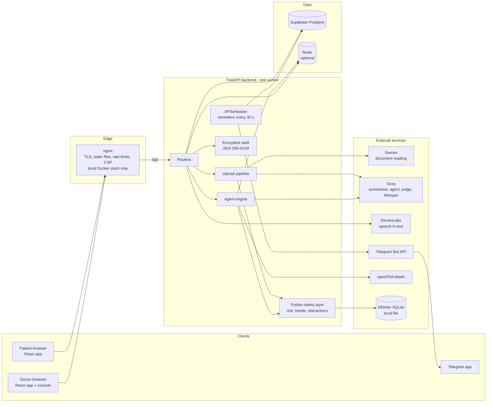
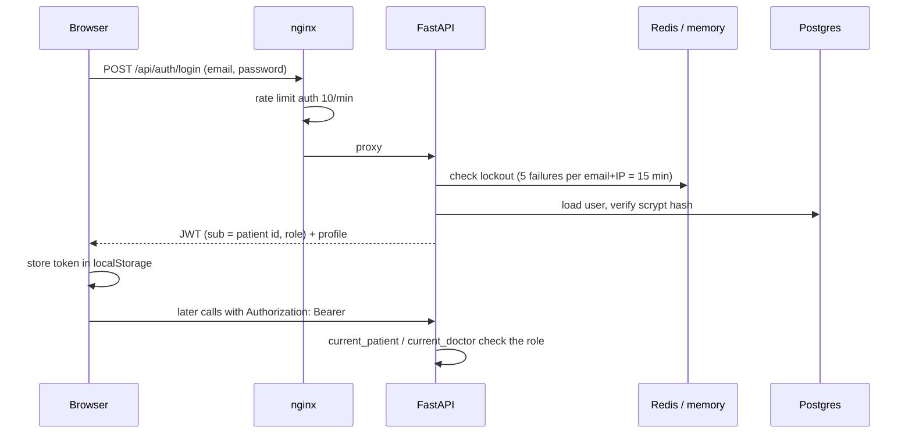
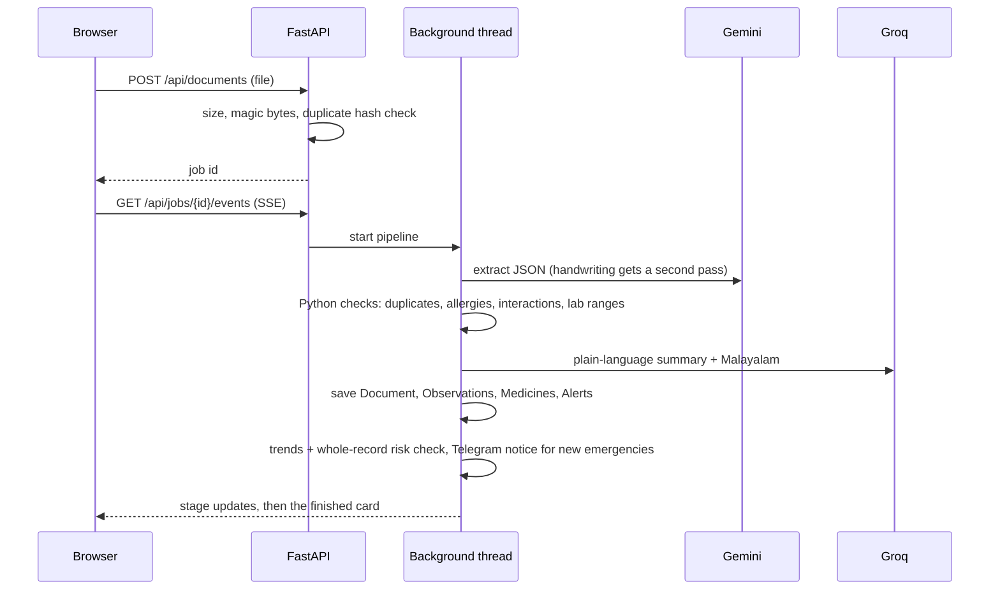
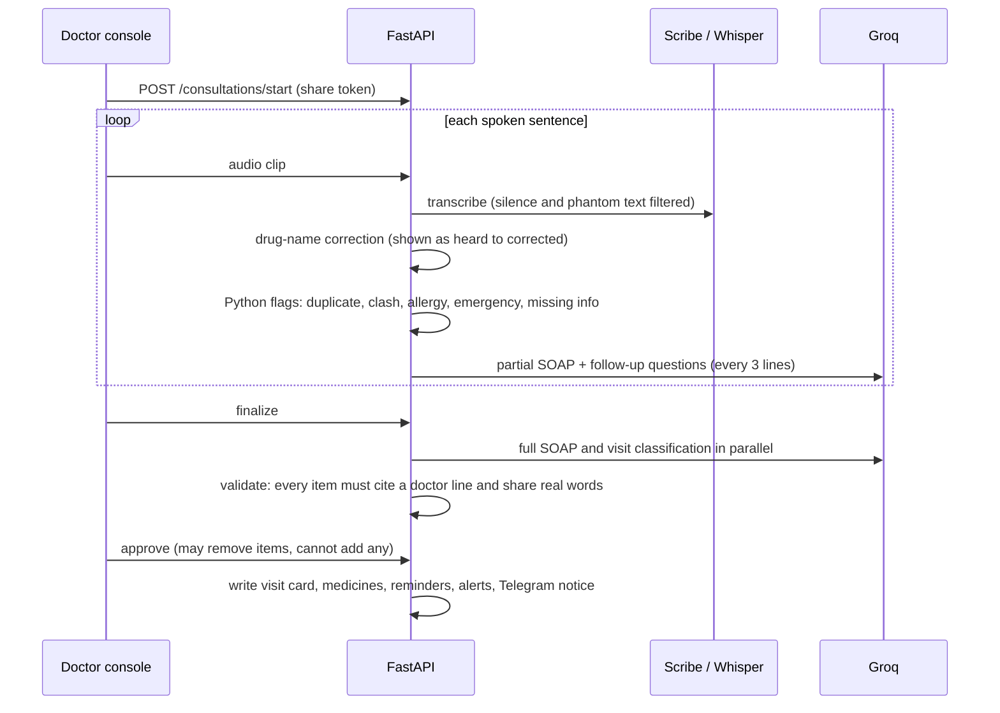
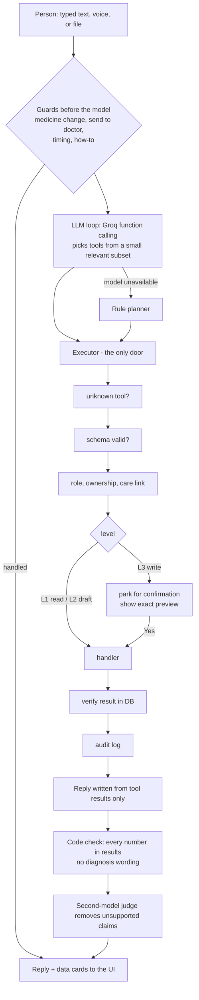

# MediThread

One health thread for every family. Upload a prescription or lab photo and MediThread reads it, explains it in plain English and Malayalam, checks it against the rest of the record for danger signs and bad medicine combinations, and reminds the patient on Telegram. A doctor gets a read-only view of the linked patient and a voice console that turns a spoken visit into a SOAP note. An assistant (the **Agent**) can read the record, explain it and take safe actions on it, always asking Yes or No before it saves or shares anything.

Team FullSleeve: S. Aariyan, Jithin P R, Mathew Maijo. Built for the YODHA hackathon (core: Problem Statement 2, unified healthcare journey; also Problem Statement 1, clinical documentation assistant).

**The one rule that shapes everything:** the AI proposes, code decides. The AI never diagnoses and never tells anyone what to take. It restates what a document or a doctor said, and flags things to show a doctor. Every number it states must exist in the record, every write goes through a registered tool, and anything that changes data is confirmed by the person first.

## Contents

1. [Features](#features)
2. [Architecture](#architecture)
3. [Request flows](#request-flows)
4. [The Agent](#the-agent)
5. [Data model](#data-model)
6. [Safety and privacy](#safety-and-privacy)
7. [Repository layout](#repository-layout)
8. [Start it](#start-it) (run locally, accounts, Docker stack)
9. [Deploying](#deploying)
10. [Environment variables](#environment-variables)
11. [Demo mode](#demo-mode), [tests](#tests-and-checks), [known limits](#known-limits)

## Features

| Area | What it does |
| --- | --- |
| Records | Photo or PDF upload (jpg/png/webp/pdf, 10 MB, type checked by magic bytes). Gemini extracts, Groq writes the summary and Malayalam translation. Hospital FHIR bundles import with de-duplication. Handwritten prescriptions get a second careful reading; anything not agreed by both readings is shown as "unclear", never saved as a medicine. |
| Timeline and charts | Every record on one thread, with trend charts for every test that has two or more results. |
| Safety checks | Duplicate medicines, allergy clashes, drug interactions (DDInter plus hand-written patient messages), lab thresholds, rising trends, and a whole-record danger check (blood pressure, sugar, kidneys, potassium, oxygen and more) in plain Python. Emergency banner with a Call 108 button. |
| Health review | A plain-language AI review of the whole record. Points whose numbers are not in the record, or that diagnose or advise on medicines, are dropped in code. Falls back to rules without Groq. |
| Reminders | Telegram message per dose, hourly nudges until taken, a missed-dose alert to the family, refill and follow-up notices. Survives restarts. |
| Doctor finder | Ranked by distance, rating, specialty, language and hours on an India map (fictional sample directory). |
| Doctor console | A linked doctor speaks the visit (speech to text), flags and suggested questions appear live, the visit is classified into complaints, diagnoses, medicines, tests and advice, and nothing reaches the patient until the doctor approves. |
| Agent | Chat or voice assistant for patients and doctors, with files, PDFs, confirmations, background tasks and an audit log. See [The Agent](#the-agent). |
| Onboarding | A guided tour and an auto-playing demo for new users, and the Agent answers "how do I..." questions and can show the steps on screen. |
| Accounts | Email and password, patient or doctor roles, one-time invite codes to link a doctor, revoke any time, access history. |

## Architecture

### System context



### Deployment shapes

| | Local Docker stack | Hosted (Render) |
| --- | --- | --- |
| Entry | nginx on 8080 (http) and 8443 (https) | one web service |
| Frontend | built into the nginx image | built into the API image, served by `app/static_site.py` |
| Backend | `backend` container, one uvicorn worker, read-only filesystem | same code in one container (`deploy/render/Dockerfile`) |
| Redis | `redis:7-alpine` with AOF volume | none: state falls back to memory |
| Database | Supabase Postgres (transaction pooler, port 6543) | Supabase Postgres |
| Files | Docker volume `vault` | container disk (wiped on redeploy) |

Optional overlays: `docker-compose.ai.yml` adds the Laya triage classifier, and `docker-compose.htr.yml` adds a TrOCR handwriting reader. Both are off by default.

### Backend layers

```
routers/        HTTP only: auth, patients, documents, consultations, reminders, doctors, shares, care,
                doctor, imports, agent, doctor_agent, admin, demo
app/            domain logic in plain Python: auth, risk, trends, labs, vitals, health_hooks,
                reminder_service, fhir_import, vault, store (Redis with memory fallback), observability
app/agent/      the Agent engine: planner, loop, executor, registry, permissions, tools, judge, memory, tasks, audit
ai/             everything that talks to a model or an AI-adjacent dataset: extractor, handwriting,
                pipeline, translator, health_review, consultation, visit_classify, transcribe,
                safety/ddi/interactions, drug_usage, decision (Laya), triage_rules, doctor_ai
```

The rule inside every layer: **models write words, Python decides facts.** Risk levels, the emergency banner, interaction alerts, trend alerts and every permission check never depend on a model.

### Frontend

React 19 and Vite (JavaScript). `src/api/client.js` lists every endpoint. `src/design/` holds the component system and `mt.css` (tokens, chapters, components). `src/pages/` has the screens (Home, Health Thread, Health Check, Medicines, Reminders, Doctors, Sharing, Upload, Triage, Profile, doctor home and console, Admin). `src/components/agent/` is the Agent panel, `src/components/tour/` the guided tour. Motion uses GSAP and IntersectionObserver, with reduced-motion support. A mock-data build (`npm run build:single`) runs from `file://` as an offline backup.

## Request flows

### Sign in



A doctor token on a patient route is 401, and the reverse. A doctor sees a patient only through an active care link (otherwise 404).

### Upload a record



Results are cached by file SHA-256 in `BackEnd/demo_cache/`, so a re-upload replays instantly and does not spend quota.

### A doctor visit



Nothing reaches the patient timeline before approve.

### Reminders

`app/reminder_service.py` runs an APScheduler job every 30 seconds (Asia/Kolkata). For each dose it claims a dedup key (`medicine@HH:MM@date`) in the store and in the `sent_doses` table before sending, so a restart never double-sends. It also sends hourly nudges (max 5 per dose, none after 22:00), a missed-dose message to the family chat, and refill and follow-up notices the day before.

## The Agent

One engine, two agents (patient and doctor). The model never touches the database: it can only propose **registered tool calls**, and code decides what runs.



- **Levels.** L1 read; L2 reversible or draft (navigate, summarise, PDF, extraction); L3 writes, always confirmed with a preview and a verify afterwards; L4 never executes (medicine changes: the Agent explains, and no tool exists).
- **Tools** (about 46): patient reads (what changed, open items, medicines, interactions, side effects from FDA labels with verified quotes, triage, nearby doctors, navigation), files and PDFs, writes (add record from file, create or revoke a share, revoke a doctor, mark dose taken, log a reading, confirm unclear medicines, set up Telegram reminders), doctor tools (brief, changes since visit, record conflicts, missing info, draft and approve a visit), and `app.help` and `app.tour` for how-to questions.
- **Tasks.** Quick plans run inline. Plans with a slow step run in a background thread (`agent_tasks` table), and the UI polls for step labels. A task stops at the first failure or confirmation.
- **Files.** Uploaded files are encrypted with AES-256-GCM (`app/vault.py`), bound to the file and patient by AAD. Extraction keeps a value only if it is found in the document's own text, with page, line and quote.
- **Memory** keeps the person's words, tool names and verified replies for 2 hours. It never stores record or document text.
- **Voice.** Audio becomes text in the input box (ElevenLabs Scribe, falling back to Groq Whisper). Speech never runs a tool by itself.
- **Audit.** Every tool call writes ids and outcomes (never record text or secrets) to `agent_audit`. An admin page (`/admin`, allow-listed emails) shows counts only.

## Data model

Main tables (SQLAlchemy, `app/models.py`; `add_missing_columns()` adds new nullable columns at startup):

| Table | Holds |
| --- | --- |
| `users`, `patients` | login identity (role patient or doctor) and the patient profile |
| `documents` | timeline cards: type (`lab`, `prescription`, `consultation`, `visit`, `scan`), summary EN and ML, extracted items, source lines, `external_id` for import dedupe |
| `observations` | every lab and vital value with code, LOINC, unit, reference range and source |
| `medicines`, `reminders`, `sent_doses`, `sent_notices`, `reminder_settings` | prescriptions, dose times, send tracking, per-patient reminder preferences |
| `alerts` | open warnings by kind (`interaction`, `duplicate`, `clash`, `allergy`, `lab`, `trend`, `risk`, `handwriting`) and severity |
| `share_links`, `invite_codes`, `care_links` | QR links, one-time doctor codes, active doctor access |
| `consultations` | transcript, flags, SOAP note, classification, state |
| `agent_tasks`, `agent_files`, `agent_audit` | Agent work, encrypted file records, audit trail |
| `ai_decisions` | audit of Laya decisions (hash of the input, never the text) |

## Safety and privacy

- **Role separation.** Patient and doctor tokens are not interchangeable. Unlinked or fake ids answer 404, so ids cannot be probed. Fake share tokens answer 404, expired ones 410.
- **Doctors never see "handwriting unclear" notes.** Those alerts are patient-only and are filtered out of shares, the doctor view, the doctor Agent and PDFs.
- **Nothing silent.** Writes need confirmation. The medicine-change guard runs before the model. "Send to my doctor" never fakes delivery.
- **Secrets stay secret.** Tokens never appear in task results, audit or logs (request paths are redacted, and the HTTP client loggers are forced to WARNING because they would log the Telegram URL). Share-link QR tokens are fetched once from short-lived storage.
- **Encryption.** Vault files use AES-256-GCM with a random storage key. Passwords use scrypt.
- **Edge hardening** (Docker stack). Rate limits, 11 MB upload cap, CSP and security headers, non-root containers, read-only backend filesystem, no published port for the backend or Redis.
- **Data sources.** DDInter (CC BY-NC-SA 4.0) and one training dataset are non-commercial; see `ml/DATA_LICENSES.md`. The doctor directory is fictional.

## Repository layout

```
BackEnd/            FastAPI app (see Backend layers), scripts/ (tests, smoke, security sweep), data/ (doctors, DDInter)
Frontend/           Vite + React app
deploy/nginx/       nginx image, config snippets, certificate generator
deploy/render/      single-container Dockerfile for the hosted copy
laya/, ml/, models/ optional triage classifier service, training code and datasets, local weights
htr/                optional TrOCR handwriting service
docker-compose*.yml the stack and its optional overlays
render.yaml, DEPLOY.md   hosted deployment blueprint and steps
SPEC.md, CLAUDE.md  original spec and working notes for contributors
```

## Start it

You need Python 3.12+ and Node 20+. Put a `.env` in the repo root (see the table below). The backend creates and seeds its tables on first start.

```bash
# terminal 1: backend (port 8000)
cd BackEnd
python3 -m venv venv && ./venv/bin/pip install -r requirements.txt   # first time only
./venv/bin/uvicorn app.main:app --reload --port 8000

# terminal 2: frontend (port 5173, proxies /api to 8000)
cd Frontend
npm install                                                            # first time only
npm run dev
```

Open http://localhost:5173 and **Create account**, choosing patient or doctor. With `DEMO_MODE=true` there is also a "Try the demo patient" button (Ammini, seeded data).

## Accounts: testing as patient and doctor

Sign-in is email + password (passwords are hashed with scrypt; 5 wrong tries lock that email and IP for 15 minutes). There is no email check and no password reset; a forgotten password means a new account.

1. **Patient** creates an account, then opens **Sharing > Invite your doctor > Make a code**. The code (like `TX9W-R9DJ`) works once and expires after 24 hours.
2. **Doctor** creates an account (I'm a doctor), pastes the code on **My patients > Add patient**, then presses **Open record** to see the history and run the consultation console (the doctor's name comes from the account). Nothing the doctor records reaches the patient timeline until they approve the note.
3. The patient sees every doctor action in **Who viewed your records** and can press **Remove access** at any time. That also kills any console link that doctor already opened.

To try it with a friend on the same Wi-Fi, run the backend without `DEMO_MODE` and the frontend on the network with the Vite proxy (so their browser reaches the API through your machine):

```bash
cd BackEnd && ./venv/bin/uvicorn app.main:app --port 8000
cd Frontend && VITE_API_URL= npm run dev -- --host      # friend opens http://<your-LAN-IP>:5173
```

Use two different browsers or origins (for example `localhost` and `127.0.0.1`) if you test both roles on one computer, because the session lives in localStorage. Traffic is plain HTTP on the LAN: fine for a two-person test, not for the public internet. The microphone only works on `localhost` or HTTPS.

Run exactly one backend process per database. Each one starts a reminder scheduler, and two can send the same dose.

## Run it as a stack (nginx + Redis + backend)

Docker Desktop must be running. From the repo root:

```bash
docker compose up -d --build --wait         # nginx, backend, Redis (Postgres stays on Supabase, from .env)
open https://localhost:8443                 # self-signed certificate: accept the warning once (http://localhost:8080 also works)
```

What you get: nginx serves the built React app and proxies `/api` to the backend (gzip, one-year cache for hashed assets,
security headers and a Content-Security-Policy, rate limits on sign-in and uploads, 11 MB upload cap, SSE progress
streams unbuffered, JSON access logs with share tokens and job ids redacted). The backend runs one worker (it owns the
reminder scheduler) as a non-root user on a read-only filesystem, with Redis for login throttling, "taken" flags and dose
de-duplication. Redis and the backend have no published ports: only nginx is reachable from outside.

- Readiness: `curl http://localhost:8080/api/health/ready` shows database, Redis, scheduler, DDInter and Laya status.
- Demo mode: `DEMO_MODE=true docker compose up -d backend`. LAN friend: `CERT_SANS="DNS:localhost,IP:127.0.0.1,IP:<your-LAN-IP>" docker compose up -d --build --wait` (HTTPS also makes the microphone work).
- Edge checks: `cd BackEnd && ./venv/bin/python scripts/test_nginx.py`. Run `smoke.py` and `security_sweep.py` inside the container so nginx's rate limits do not count them: `docker compose exec -e BASE_URL=http://127.0.0.1:8000 backend python scripts/smoke.py`.
- Without Docker: `brew services start redis` and the two dev commands above work as before; the app falls back to in-memory storage if Redis is down.

## AI decision layer and datasets

- **Interactions**: `BackEnd/ai/safety.py` (formerly `jev_client.py`, there was never a Jev service) looks pairs up in the DDInter dataset (about 160k pairs, Major / Moderate; build it with `cd BackEnd && ./venv/bin/python scripts/build_ddi.py`) after the hand-written patient messages. Unknown pairs give no alert.
- **Laya** (https://huggingface.co/convaiinnovations/laya): a small classifier that helps with symptom triage and with spotting emergencies in what a patient types or a doctor says, in English, Malayalam and Manglish. Rules always run first; the model can only raise urgency, never lower it, and it is used only after it passes its own evaluation gate. Setup, training and the honest numbers are in [`ml/README.md`](ml/README.md). Run it with `docker compose -f docker-compose.yml -f docker-compose.ai.yml up -d --build --wait`.
- Data sources and licences: [`ml/DATA_LICENSES.md`](ml/DATA_LICENSES.md). DDInter and one training source are non-commercial.

## Deploying

The hosted copy is one Render web service that runs the API and serves the built frontend (see `render.yaml`, `deploy/render/Dockerfile` and `DEPLOY.md`). Set the secrets in the Render dashboard, not in the repo. Free-tier limits apply: the service sleeps when idle (so reminders pause), Redis is absent (state is per process), and the vault does not survive a redeploy. Run only one copy against a database at a time: a local stack and the hosted one together would each send every reminder.

## Environment variables

Set them in the root `.env` (gitignored). Never commit values.

| Name | Used by | Notes |
| --- | --- | --- |
| `DATABASE_URL` | backend | Supabase **session pooler** URL (`*.pooler.supabase.com`). If missing or unreachable the backend uses `BackEnd/medithread.db` (SQLite). |
| `REDIS_URL` | backend | Optional. Without it OTP and "taken" state live in memory and reset on restart. |
| `JWT_SECRET` | backend | Signs login tokens. Set a long random value outside local dev. |
| `GEMINI_API_KEY` | backend | Reads uploaded documents. Free tier runs out; the code falls through a model list. |
| `GROQ_API_KEY` | backend | Summaries, Malayalam, consultation notes. |
| `TELEGRAM_BOT_TOKEN` | backend | Reminder delivery. Blank = server runs, nothing is sent. |
| `TELEGRAM_CHAT_ID` | backend | Default chat for the demo patient. Get yours by messaging the bot first. |
| `CORS_ORIGINS` | backend | Comma-separated browser origins allowed to call the API. Default: the two local dev URLs. A bare `*` is ignored unless `DEMO_MODE=true`. |
| `DEMO_MODE` | backend | `true` turns on the demo-only endpoints (see below). Off by default. |
| `OPENFDA_ENABLE` | backend | `1` adds an OpenFDA lookup for unknown drug pairs. Off by default (too many false positives). |
| `RESET_DB` | backend | `1` drops all tables and re-seeds at startup. |
| `FILE_ENC_KEY` | backend | 32-byte urlsafe base64 key for the encrypted file vault. Without it file features answer 503. `FILE_ENC_KEY_PREV` decrypts old files during rotation. |
| `ELEVENLABS_API_KEY` | backend | Optional. Speech to text for the Agent and console (Scribe). Falls back to Groq Whisper. |
| `ADMIN_EMAILS` | backend | Comma-separated emails allowed to open `/admin`. |
| `LAYA_URL`, `HTR_URL` | backend | Optional Laya triage and TrOCR services. Off when unset. |
| `AGENT_JUDGE` | backend | `0` turns off the second-model reply judge. |
| `DB_POOL_MODE` | backend | `transaction` (Docker default) uses Supabase port 6543; `session` opts out. |
| `VITE_USE_MOCK` | frontend | `true` runs the UI on built-in mock data, no backend needed. |
| `VITE_API_URL` | frontend | Backend base URL. Empty = same origin (Vite proxy). |

## Demo mode

Start the backend with `DEMO_MODE=true`:

```bash
cd BackEnd && DEMO_MODE=true ./venv/bin/uvicorn app.main:app --port 8000
```

This enables, for a logged-in user only (404 otherwise):

- `POST /api/demo/fire-reminder` and `/api/demo/fire-missed`: send a dose reminder or a missed-dose alert to Telegram now.
- `POST /api/demo/reset`: put Ammini back to the clean seed (8 records, 3 medicines, 3 alerts), delete uploads, imports, consultations and sent-dose rows, and turn her Telegram reminders on. `BackEnd/demo_cache/` is kept.
- `GET /api/health/deep`: one tiny call each to the database, Redis, Gemini, Groq, Telegram (read-only `getMe`) and the scheduler. No keys are ever returned.

On the **Reminders** tab a "Demo controls" card shows the services status line, the two fire buttons and **Reset demo**.

Keep the files in `BackEnd/demo_cache/`. They replay the three test images instantly, so the demo does not depend on Gemini quota. The cache is gitignored; copy it to any new machine.

### Offline backup

```bash
cd Frontend && npm run build:single      # writes Frontend/dist-single/index.html
```

One self-contained file that opens from `file://` with no server. It is pinned to mock data and uses `#/` routes, so login, timeline, upload, hospital import and the doctor console demo all work offline. It cannot talk to the real backend.

## The 4-minute demo

Before you start: backend running with `DEMO_MODE=true`, frontend running, Telegram open on your phone, Chrome (for voice). Log in, open **Reminders**, check every item in the status line says ok / ready / running, press **Reset demo** and confirm.

| Time | Click path | What to say |
| --- | --- | --- |
| 0:00 | Log in (`9876543210`, any 6 digits). **Home**. | Today's medicines and three warnings already waiting: Clarithromycin with Atorvastatin, Metformin written twice, LDL above target. |
| 0:30 | **Timeline**. Tap **മലയാളം** in the top bar. | Eight records in one thread. Every summary is also in Malayalam. |
| 0:50 | **Health**. | The sugar chart is built from stored lab values, not mock data. HbA1c fell from 9.1 to 7.2. |
| 1:10 | **Add**. Choose `BackEnd/test_docs/sunrise_prescription.png`, press **Analyse**. | Five stages. Two new warnings: a drug clash and a duplicate. Press **Turn on these reminders**: the phone buzzes in Telegram. |
| 1:50 | Still on **Add**. Press **Use sample hospital record**. | A hospital's FHIR file. "Imported 7 records", with a duplicate warning for Telmisartan. Importing it again adds nothing. |
| 2:20 | **Add**, choose `BackEnd/test_docs/lab_report.png`, **Analyse**. | A new HbA1c of 8.2 makes three rises in a row: "7.2, 7.6, 8.2. Show this to your doctor." Plain Python, no AI, no cause, no treatment. |
| 2:50 | **Sharing**, **Create share link**, **Open doctor console**. Press **Play demo conversation**. | Safety flags appear as the doctor speaks. Press **Stop and review**, then **Approve and send to patient** and confirm. |
| 3:30 | In the approved panel, switch English / മലയാളം and press **Read aloud**. Back in the patient app, **Timeline**: the visit is the first card. | Nothing reached the patient until the doctor approved. |
| 3:45 | **Reminders**, **Fire missed dose alert now**. | The family gets a Telegram message. |
| 4:00 | **Reset demo** (or leave it). | |

## Tests and checks

```bash
cd BackEnd
./venv/bin/python -W ignore scripts/test_auth.py -v          # accounts, roles, invite codes, revoke
./venv/bin/python -W ignore scripts/test_ddi.py -v           # DDInter lookups and severity mapping
./venv/bin/python -W ignore scripts/test_decision.py -v      # Laya client, escalate-only merge, triage route (model faked)
./venv/bin/python -W ignore scripts/test_trends.py -v        # trend alert rules
./venv/bin/python -W ignore scripts/test_fhir.py -v          # FHIR import, dedupe, bad input
./venv/bin/python -W ignore scripts/test_reminders.py -v     # reminder engine, fake clock
./venv/bin/python -W ignore scripts/test_risk.py -v          # danger checks, vitals parsing, AI-review guard
./venv/bin/python -W ignore scripts/test_doctors.py -v       # doctor finder: India-only, ranking, query parsing
./venv/bin/python scripts/smoke.py                           # needs a running server with DEMO_MODE=true
./venv/bin/python scripts/security_sweep.py                  # needs a running server
```

`smoke.py` and `/api/demo/reset` wipe the demo patient's uploads, imports and visits in whatever database the server points at.

## Known limits

- **Telegram is the only reminder channel.** The "notify on this phone" toggle only asks for browser permission and saves the setting. Nothing is pushed to the browser.
- **Browser voice needs Chrome and internet.** Voice typing uses the browser's Web Speech API, which sends audio to a cloud service. Other browsers get the typed-line fallback.
- **Free hosting sleeps.** On a free tier the server stops after idle time, the first request takes a long time to wake it, and the reminder scheduler does not run while it sleeps, so doses in that window are never sent. Open the app a minute before a demo.
- **Gemini's free tier runs out.** Uploads that are not in `demo_cache/` fail with a plain error when every model returns 429. Summaries fall back to plain text if Groq fails.
- **No email verification or password reset.** The demo patient button and the phone OTP (any 6 digits) exist only with `DEMO_MODE=true`.
- **Doctor data is fictional.** The doctor finder uses a made-up, Kerala-heavy sample directory (`BackEnd/data/doctors.json`); names, clinics, phone numbers and reviews are not real. The map needs internet for OpenStreetMap tiles.
- **AI review needs Groq.** Without `GROQ_API_KEY` the health review and doctor explanations fall back to simple rules. Danger checks and the emergency banner never depend on AI.
- **Not a medical device.** The checks cover a small list of common drugs and lab ranges. Always ask a doctor.
