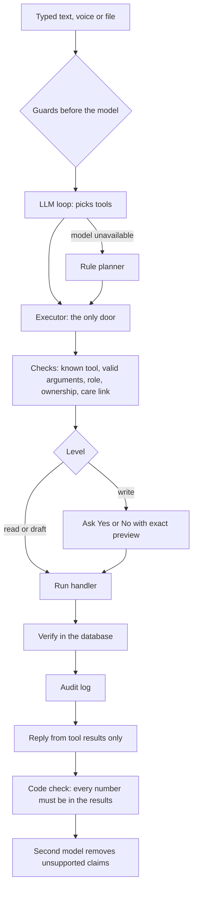

# Agent

Back to [[Home]]. One engine, two agents (patient and doctor). **The model never touches the database.** It can only propose registered tool calls; code decides what runs.

## Levels
- **L1** read. **L2** reversible or draft (navigate, summarise, PDF). **L3** writes: always confirmed, with a preview and a verify afterwards. **L4** never executes (medicine changes): the agent explains, and no tool exists.

## Tools (46)
Patient reads (what changed, open items, medicines, interactions, side effects from FDA labels with verified quotes, triage, nearby doctors, navigation), files and PDFs, writes (add record from file, share, revoke, mark dose taken, log a reading, confirm unclear medicines, set up Telegram reminders), doctor tools (brief, changes since visit, record conflicts, missing info, draft and approve a visit), and `app.help` / `app.tour` for how-to questions.

## Other parts
- **Guards before the model:** medicine change, "send to my doctor" (we cannot send, so we offer a link, QR or PDF), timing questions, how-to.
- **Tasks:** quick plans run inline; slow ones (reading a file) run in a background thread and the UI polls.
- **Memory:** the person's words, tool names and verified replies, 2 hours. Never record or document text.
- **Voice:** speech becomes text in the input box. Speech never runs a tool by itself.
- **Audit:** ids and outcomes only.

Related: [[Safety and privacy]], [[Token optimisation]], [[AI services]].
