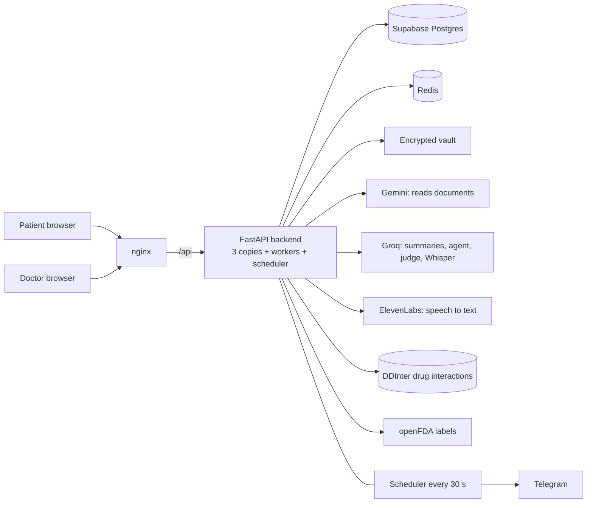

# Architecture

Back to [[Home]].

## Layers
| Layer | Folder | Rule |
| --- | --- | --- |
| HTTP | `BackEnd/app/routers/` | thin: auth, patients, documents, consultations, reminders, doctors, shares, care, agent, admin |
| Domain | `BackEnd/app/` | plain Python: risk, trends, labs, vitals, reminder_service, fhir_import, vault, store |
| Agent | `BackEnd/app/agent/` | planner, loop, executor, registry, permissions, judge, tasks, audit — see [[Agent]] |
| AI | `BackEnd/ai/` | everything that calls a model — see [[AI services]] |
| Frontend | `Frontend/src/` | see [[Frontend]] |

**The rule inside every layer: models write words, Python decides facts.** Risk levels, the emergency banner, interaction alerts, trend alerts and every permission check never depend on a model.

## Two deployment shapes
See [[Deployment]]: local Docker stack (nginx + Redis) and the Render copy (one container, no Redis).

Related: [[Request flows]], [[Safety and privacy]], [[Scalability]].
